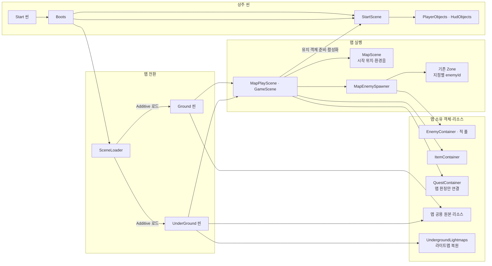

# 공통·지상·지하 리소스 소속

## 기능 연결 코드

GroundQuestController는 판정·연결을 맡고 진행 단계 조회는 GroundQuestProgress가 담당한다. 호출되지 않는 Step·HasExitArea 속성을 제거했으며 퀘스트 처리와 Inspector의 출구 참조는 유지했다. 이번 간소화는 컴파일까지 확인했고 Play 확인은 남아 있다.

치트의 퀘스트 탭은 BootsCheat를 통해 StartScene.Quests.Ground의 유지 기록을 조회한다. 기존 기록 함수와 Editor 전용 초기화는 진행 알림만 보내며 맵 판정·가방·교환 객체를 바꾸지 않는다. 퀘스트 탭의 컴파일과 미실행 대기 표시는 확인했고 Play 조작은 남아 있다. [퀘스트 치트 안내](../90.Editor/README.md#퀘스트-탭)를 참고한다.

EnemyZoneController는 소환할 enemyId·위치·재진입을 관리한다. GroundQuestController와 QuestContainer는 플레이어 인벤토리·맵 출구 판정을 Quest의 진행 규칙에 연결한다. 이 세 클래스는 다른 기능을 연결하는 게임 흐름이므로 10번 이전인 이 폴더에 둔다. Ground의 MapScene에 기존 지상 퀘스트 연결 컴포넌트를 붙였으며 exitArea는 미지정이다. 설정 데이터와 연결 상태는 [06.Data](../06.Data/README.md)를 참고한다.

씬 파일이 지역 리소스 참조를 소유한다. 에셋 파일의 폴더는 제작·수정 위치이며, 실제로 어느 지역에서 사용하는지는 씬의 참조로 구분한다.

## 씬 실행 코드

Start의 Boot에는 `Scene.StartScene`을 두고 Boots가 같은 객체에서 참조를 얻는다. Ground의 MapScene 오브젝트와 UnderGround의 StartArrival에는 `Scene.MapPlayScene`을 배치하고 같은 씬의 MapScene 설정을 연결했다. 지하 시작 위치는 기존 StartArrival이며 환경음은 미지정이다. 두 AudioSource는 기존 NightShade 효과음 소스이므로 환경음으로 연결하지 않았다.

SceneLoader는 씬 전환 순서만 결정하고 GameScene의 생성·실행·정리 함수를 호출한다. MapPlayScene이 전역 데이터를 조회해 맵의 몬스터·아이템·퀘스트를 연결한다. 이탈 때 맵 객체와 구독을 해제하고 Start의 플레이어·HUD·진행 기록은 유지한다. QuestContainer.Disconnect는 떠나는 맵의 판정만 제거한다. UI 연결이 필요한 실행 코드는 Game.Boot에 속하는 00.Scene/Play에 두며 MapScene·배치 코드는 기존 Game.Runtime을 유지한다.

이 폴더의 개발용 코드·지하 조명 코드까지 `Scene` 이름공간을 사용한다. Unity의 씬 타입을 참조할 때는 `UnityScene` 별칭으로 구분한다.

- [MapManager.cs](../02.Manager/Resources/MapManager.cs): SceneLoader의 맵 Address 입력 → AddressableManager에 씬 추가 로딩·캐시 요청 → refCount가 0인 씬 정리.
- [MapScene.cs](MapScene.cs): Inspector의 시작 위치·선택 환경음 참조 → 같은 씬 연결 확인 → 게임 준비 후 환경음 재생·반환 전 정지.
- [MapEnemySpawner.cs](MapEnemySpawner.cs): 로드된 맵·활성 플레이어·EnemyDataContainer → enemyId 조회 후 같은 맵의 활성 EnemyZoneController 연결과 EnemyContainer 생성 → 적 갱신·소환 중지·풀 반환.
- [UndergroundLightmaps.cs](Underground/UndergroundLightmaps.cs): 저장된 텍스처·Renderer 참조 → 라이트맵 슬롯 연결 → 지하 조명 복원.

`00.Scene`과 `00.Scene/Underground`는 각각 `Game.Runtime.asmref`로 연결한다. `GameScene`은 맵 실행 호출 계약이고, `MapPlayScene`은 씬 안의 맵 객체와 갱신을 소유한다. 맵 주소 로드·현재 씬 반환은 [SceneLoader](../03.Loading/SceneLoader.cs), 공통 캐릭터 생명주기는 [Core.Unit](../04.Core/Character/Lifecycle/Unit.cs)이 맡는다.

Start 단독 Play에서 Ground 활성 씬 지정, Start 소속 플레이어·HUD 생성, 낮 환경 화면, 환경음 재생 상태, 활성 Camera·AudioListener 각각 1개와 Missing Script 0을 확인했다. 실제 스피커 청음과 번들 빌드는 미검증이다. 전체 생성·반환 검증은 [진입점 안내](../01.Boot/README.md#확인과-남은-작업)에 기록한다.

| 구분 | 참조를 소유하는 씬 | 주요 대상 | 로딩 시점 |
| --- | --- | --- | --- |
| 시작 진입점 | Start.unity | Boot·StartScene·MainCamera, 실행 중 PlayerObjects·HudObjects 아래의 PlayerRoot·CombatHud | 게임 시작 |
| 지상 전용 | Ground.unity | 지상 건물·나무·지형·충돌, Setup&Lights, Zone·Road, 좀비 생성 설정, 지상 아이템 배치 | 지상 진입 |
| 지하 전용 | UnderGround.unity | 지하 건물·지형·충돌, Setup&Lights, 층별 지도, NightShade 프리팹 배치 | 지하 로딩 요청 |
| 맵 공용 | Ground와 UnderGround | 양쪽에서 사용하는 같은 원본 모델·머티리얼·텍스처·Bake 텍스처 | 사용하는 지역 진입 |

Ground와 UnderGround는 각자 씬 안의 배치와 참조를 소유하고, 공용 원본은 두 씬에서 함께 참조할 수 있다. 씬 안에 배치된 객체와 원본 에셋의 소유 범위는 구분한다.

MapEnemySpawner는 일반 C# 객체로 MapPlayScene이 소유한다. MapPlayScene이 기존 Zone을 연결하며 새 배치 지점은 추가하지 않는다. Zone의 소환은 기존처럼 최초 시작과 플레이어 재진입 때 빈 자리를 채운다. 반환은 구역 StopSpawning·Disconnect → EnemyContainer.Dispose → 맵 요청 반환 순서다. 새 연결의 컴파일과 Ground 설정·NavMesh를 편집 상태에서 확인했으며 실제 Play 흐름·빌드는 미검증이다.

공통 상주는 Start에서 참조하는 에셋이다. 지상·지하에서도 같은 에셋을 참조할 수 있다. Addressables의 Common은 씬 이름이 아니라 공용 번들 그룹이다. 맵 공용 원본의 번들 중복 분석에 따라 603개 에셋을 Common 그룹에 등록했다. 공유한다는 이유만으로 Start에 프리팹 참조를 추가하지 않는다.

예를 들어 지상과 지하에 같은 바위 프리팹을 배치하면 각 GameObject는 해당 씬에 소속되지만 원본 모델·머티리얼·텍스처는 맵 공용이다. 지상을 해제하면 지상 바위는 제거되고 지하 바위가 사용하는 원본은 유지된다. 원본 파일을 지상용·지하용으로 복제하거나 공용 목록 ScriptableObject에 모아서 Common이 참조하게 만들지 않는다.

## 소속을 확인하는 방법

1. `Tools > World > 리소스 소속`을 연다.
2. 전체·지상·지하·공용 탭에서 목록을 확인한다. 지상·지하는 해당 씬이 사용하는 공용 에셋도 포함한다. 공용 탭은 Common 상주와 두 맵이 공유하는 원본을 모아서 표시한다. 실제 참조 씬 열과 소속 설명에서 Common 상주인지 맵 공유인지 확인한다. 탭이 겹치므로 탭별 개수의 합은 전체 개수와 다르다.
3. 배치 이름·파일 이름·경로로 검색한다. 에셋 경로를 누르면 Project에서 선택하고, `연결된 배치`를 누르면 Hierarchy에서 선택한다. `배치 선택`은 같은 원본을 사용하는 검색 결과의 배치들을 보여 준다. 다른 분류 탭에 결과가 있으면 `전체에서 보기`로 확인한다.
4. `에셋·배치 다시 읽기`는 저장된 씬의 에셋 소속과 현재 열린 씬의 배치 이름을 연결한다. 배치 이름 변경은 저장 전에도 읽으며, 새 에셋을 추가했다면 씬 저장 후 다시 읽는다. 비활성 객체와 프리팹 자식도 검색한다. 닫힌 씬의 배치 이름은 해당 씬을 연 뒤 읽는다.
5. `전체 소속표 저장`으로 소속(지상·지하·공용)·참조 씬·에셋 경로·유지 기준을 UTF-8 CSV로 저장한다. 원본 에셋마다 한 행이며 공통 상주와 맵 공유는 유지 기준으로 구분한다.

Hierarchy 오브젝트를 우클릭한 뒤 `리소스 소속 찾기`를 선택해도 검색할 수 있다. 예를 들어 `sm_Chapel_02_94`를 검색하면 원본인 `SM_ChapelWall_01_02.prefab`과 해당 배치가 표시된다. CSV는 기존과 같이 에셋 소속표를 저장한다.

이 도구는 에디터에서 에셋 경로를 읽는다. 실행용 카탈로그, 프리팹 복제본, 에셋 라벨을 만들지 않는다. 목록은 씬 의존 관계이며 메모리 측정 결과는 아니다. 코드·패키지 및 문자열로 별도 로딩하는 리소스는 별도로 확인한다.

## 개발 씬 치트

CharacterTest의 `Spawn Missing Enemies` 메뉴는 [EnemySpawnerCheat.cs](Dev/CharacterTest/Scripts/EnemySpawnerCheat.cs)에 분리했다. TestSceneEnemySpawner의 Editor 전용 partial 선언에서 기존 소환 처리를 호출하며 컴포넌트를 추가하지 않는다.
분리 후 Unity 컴파일은 통과했으며, 개발 씬의 실제 수동 소환은 이번 분리 작업에서 재검증하지 않았다.

## 배치를 추가할 때

- 지상 메시·지형은 GroundObjects 아래, 지하 메시·지형은 UndergroundObjects 아래에 둔다. 메시의 충돌체와 생성 위치는 같은 씬에 둔다.
- 각 지역 씬 루트의 `Setup&Lights`가 해당 지역 환경 묶음이다. Ground에는 원본 지상 조명·프로브·볼륨을 두고, Underground에는 기존 UndergroundLights·지하 볼륨과 PostProcessing을 둔다. 장식 프리팹 안의 조명은 해당 프리팹과 같은 씬에 유지한다.
- 원본 지하 볼륨은 비활성 HDRP 설정으로 보존했다. 새 지하 PostProcessing은 기존에 공통으로 사용하던 URP DAY 프로필을 함께 참조한다. 지하 전용 톤을 조정할 때 별도 프로필이 필요한지 결정한다.
- Ground의 비활성 HDRP Volume 4개(Global, Forest, Forest DAY (1), Chappel)는 sharedProfile 참조를 제거했다. URP DAY·NIGHT 프로필과 원본 HDRP 에셋은 유지한다. Start에서 Ground를 로딩해 Missing Script 경고가 발생하지 않음을 확인했다. UnderGround의 HDRP 참조는 이번 변경 대상이 아니다.
- MapManager는 맵 요청을 전달하고 AddressableManager가 씬 로딩·핸들·사용 횟수를 관리한다. SceneLoader가 첫 Ground를 활성 씬으로 지정하며 기존 Setup&Lights·URP DAY Volume을 사용한다.
- Ground의 MapScene에는 기존 StartArrival과 같은 오브젝트의 환경음 AudioSource를 직접 연결한다. SwampForestDayLoop를 loop=true, playOnAwake=false, 2D, volume=0.2로 재생하며 SceneLoader 준비 완료 후 시작한다. 시작 위치를 이름 검색하거나 고정 좌표로 대체하지 않는다.
- Start의 MapLoading 오브젝트와 편집 도구의 교체 버튼은 제거했다. 지역 교체는 SceneLoader.LoadAsync이 현재 GameScene 정리 후 다음 씬을 로드한다. 출구 트리거는 미연결이다.
- 좀비 설정은 Ground의 Zone에 연결한다. `EnemyZoneController.Connect`는 전달받은 `EnemyContainer`에 해당 `EnemySpawnSettings` 풀을 등록한다. MapPlayScene.Enable → MapEnemySpawner.Create가 현재 맵의 활성 Zone을 연결한다. NightShade는 Underground에 직접 배치하고 Start From Scene을 켠다.
- 지역 객체를 Common의 직렬화 필드에 연결하지 않는다. 컨테이너는 미니맵·퀘스트를 참조하지 않는다. 미니맵은 Unity 씬 로딩·해제 알림에서 자신의 표시 자료만 다시 읽는다.
- 두 지역의 같은 모델·텍스처를 이름 구분 목적으로 복사하지 않는다. 맵 공용으로 관리한다. 현재 원본 Bake 텍스처도 두 지역에서 공유한다.

사용법은 [03.Loading](../03.Loading/README.md)과 [01.Boot](../01.Boot/README.md)에서 확인한다. 빌드 씬 목록과 Ground·UnderGround의 Addressables 등록은 유지한다. Start의 Boots → SceneLoader가 Ground·플레이어·HUD를 준비한다. MainCamera의 Camera·CinemachineBrain·AudioListener·URP 설정을 복원했고 Post Processing을 켰다. Ground의 데모 카메라는 비활성 상태를 유지한다. 미니맵은 CombatHud의 카메라·위치 표시가 맵의 지도 도형·MinimapFloor·MapArea를 읽도록 연결했으며 퀘스트 진행도 전달하며 출구 영역 지정은 남아 있다.

미니맵은 로딩된 MinimapFloor의 플레이어 높이 범위로 지도를 고른다. GroundObjects는 0m 이상, 지하 1층은 -10.5m 이상 0m 미만, 지하 2층은 -10.5m 미만이다. 두 맵을 함께 로딩해도 컨테이너가 미니맵에 전환 명령을 보내지 않는다.

조명 위치와 소속 후보는 [조명 소속 확인 도구](../90.Editor/SceneLightWindow.md)에서 확인한다. 범위 교차만으로 원래 조명 의도를 확정하지 않는다. 원본 지하 진입 구성은 UndergroundLights를 별도로 켰으므로 이번 배치는 이 근거를 우선했다. 재베이크는 수행하지 않았으며 기존 라이트맵 복원을 유지한다.

## 씬 전환·폴더 변경 확인

Unity 컴파일 상태와 세 씬의 직렬화 참조를 확인했다. 이번 변경 후 Play 왕복 이동·리소스 반환·메모리 프로파일링·빌드는 미수행이다. Unity 도구의 Preview 씬 조회 및 여러 씬을 닫는 요청에서 통신 오류·메인 스레드 시간 초과가 발생했으며 실제 씬 저장·열린 씬 상태를 별도로 확인했다.
