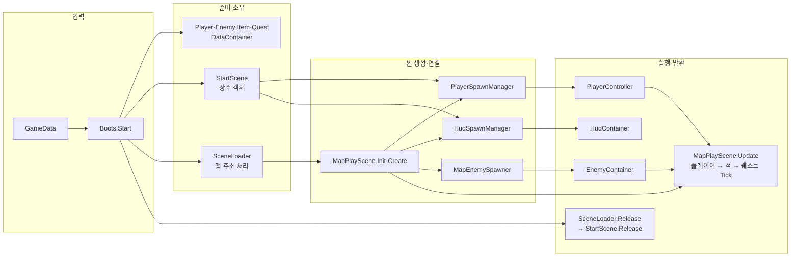

# 게임 진입점과 기능별 컨테이너

## 시작 데이터

[GameData.asset](../06.Data/GameData.asset)을 Start의 Boots.gameData에 연결한다. 설정 보관·조회는 Player·Enemy·Item·QuestDataContainer, 씬 전환은 SceneLoader, 기능 연결은 StartScene·MapPlayScene이 맡고 플레이어·HUD 생성은 PlayerSpawnManager·HudSpawnManager가 처리한다. 설정 에셋의 변경 위치와 반환은 [데이터 안내](../06.Data/README.md)를 따른다. 데이터 연결의 Play 결과와 이후 생성 담당 분리의 확인 범위는 아래 확인 항목을 따른다.

## 현재 상태

Start 씬에는 Boot와 MainCamera를 둔다. Boots가 각 종류의 DataContainer.Create로 데이터를 먼저 준비한 뒤 StartScene.Init(MainCamera, gameData) → SceneLoader.Create(ConstantValid.StartSceneName) → LoadAsync(gameData.StartMap)로 싱글톤을 준비·등록한다. Start → Ground 로딩 → 플레이어·HUD 생성·연결·활성화 → 맵의 좀비 구역 연결 순서로 실행한다. Ground는 활성 씬이 되고, PlayerObjects·HudObjects와 그 자식 PlayerRoot·CombatHud는 Start에, 좀비와 풀은 Ground에 소속된다. HUD 프리팹 안의 미니맵 카메라·플레이어 표시·현재 위치도 플레이어에 연결한다. 기존 아이템 소환·교환·지상 퀘스트에도 시작 데이터를 전달한다. SceneLoader.LoadAsync로 Ground·UnderGround를 교체하며 플레이어·HUD·진행 기록은 유지한다. 이동 트리거·BGM은 미연결이다.

참고한 로컬 리포는 D:/GitRepo/Project_P, HEAD b37aee0이다. 해당 리포의 Assets/01.Script/01.Manager/InitManager.cs, 02.Scene/SceneLoader.cs, Docs/overview.md와 Docs/architecture.md에서 진입점·씬 로딩·기능별 폴더·README 구분을 참고했다. Project_P가 엔티티별 컨테이너 구조라는 뜻은 아니다.

진입점은 `01.Boot`, 씬은 `00.Scene`에 둔다. 엔티티·게임 기능은 `10.Player`부터 번호를 붙인다. Code 폴더 없이 클래스와 역할별 하위 폴더를 각 기능 폴더 바로 아래에 둔다. 이 폴더는 `Boot` 이름공간을 사용하며 어셈블리 이름은 `Game.Boot`로 유지한다. 폴더 번호가 Unity 실행 순서를 강제하지는 않는다. Project_P의 정적 전역 접근, UniTask, UI 베이스와 외부 패키지는 가져오지 않았다.

## 파일별 책임과 소유자

| 파일 | 맡을 역할 | 소유자 |
| --- | --- | --- |
| [Boots.cs](Boots.cs) | 데이터 등록·카메라 전달·첫 씬 로드·종료 정리 | Start 씬의 Boot |
| [BootsCheat.cs](BootsCheat.cs) | Editor 치트의 게임 소유 리소스 조회·삭제, 현재 맵과 실제 보관 데이터 조회 | Boots partial, Editor 전용 |
| [SceneLoader.cs](../03.Loading/SceneLoader.cs) | 씬 정리·리소스 반환·다음 씬 실행 순서 | Create(시작 씬 이름) 후 Instance로 조회, Boots가 첫 로드·반환 요청 |
| [StartScene.cs](../00.Scene/Play/StartScene.cs) | 플레이어·HUD·퀘스트 기록 유지, 첫 생성과 다음 맵 배치 | Start 씬의 Boot |
| [MapPlayScene.cs](../00.Scene/Play/MapPlayScene.cs) | 맵의 데이터 조회·객체 연결·생성·정리 | Ground·UnderGround |
| [PlayerSpawnManager.cs](../02.Manager/PlayerSpawnManager.cs) | 플레이어 로드·생성·초기화·반환 | StartScene, 일반 C# 객체 |
| [HudSpawnManager.cs](../02.Manager/HudSpawnManager.cs) | HUD 로드·생성·연결·반환 | StartScene, 일반 C# 객체 |
| [MapEnemySpawner.cs](../00.Scene/MapEnemySpawner.cs) | 맵의 소환 구역 연결과 EnemyContainer 생성·갱신·반환 | MapPlayScene |
| [AudioListenerManager.cs](../02.Manager/AudioListenerManager.cs) | MainCamera 리스너 연결·활성화·비활성화·참조 정리 | StartScene, 컴포넌트는 Start 씬 |
| [MapScene.cs](../00.Scene/MapScene.cs) | 시작 위치·환경음 Inspector 참조와 재생·정지 | 각 맵 씬 |
| [PlayerController.cs](../10.Player/Lifecycle/PlayerController.cs) | Init 성공 후 Instance 등록, 입력·상태·인벤토리·강화 기록 소유 | 생성 객체·원본 요청은 PlayerSpawnManager |
| [QuestContainer.cs](../00.Scene/QuestContainer.cs) | 퀘스트 진행 상태와 이벤트 연결 | Create(player, questData) 후 Instance |
| [HudContainer.cs](../UI/HudContainer.cs) | 기존 HUD와 게임 상태 연결 | Create(player) 후 Instance |
| [MapManager.cs](../02.Manager/Resources/MapManager.cs) | 맵 로딩·반환 요청을 AddressableManager로 전달 | Instance |

Boots는 두 Inspector 입력(MainCamera·GameData), 같은 Boot의 StartScene, 씬 로더와 종류별 데이터 컨테이너를 보관한다. StartScene이 유지 객체를, 각 MapPlayScene이 맵 객체를 소유한다. 시작 씬 이름은 ConstantValid.StartSceneName에서 로더 생성 시 전달한다.

## 전역으로 둘 것과 인스턴스로 둘 것

PlayerDataContainer·EnemyDataContainer·ItemDataContainer·QuestDataContainer·SceneLoader·MapManager·AddressableManager·EnemyContainer·ItemContainer·QuestContainer·HudContainer는 [Singleton<T>](../04.Core/Singleton.cs)를 상속한다. SceneLoader는 Create(ConstantValid.StartSceneName)로 준비하고 전체 Release 완료·Quit에서 등록을 해제한다. Map·Addressable은 Instance로 바로 접근한다. Enemy·Item은 Create(scene), Quest는 Create(player, questData), HUD는 Create(player)로 준비한 뒤 Instance에 접근한다. 기존 기능 컨테이너는 같은 입력의 Create에서 기존 객체를 반환한다. 각 데이터 컨테이너는 Boots가 실행마다 한 번 생성하며 다른 데이터를 쓰려면 먼저 Dispose한다. 준비 전 Instance 조회는 예외다. Enemy·Item은 하나의 씬에 묶이고 Quest 재생성은 새 진행 기록으로 시작한다. MapPlayScene이 맵 소환 담당을 통해 Enemy를 연결하고 Item·Quest에 데이터를 전달한다.

| 대상 | 접근·소유 방식 | 유지·해제 시점 |
| --- | --- | --- |
| 고정 배율, Animator 해시, 고정 색상 | 각 기능 안의 const 또는 static readonly 값 | 타입 수명 동안 사용 |
| 거리·피격 판정 등 상태를 저장하지 않는 함수 | 각 기능 안의 static 함수 허용 | 호출한 입력으로 계산하고 결과 반환 |
| ZombieConfig.playSession | private static 유지. 설정 캐시 갱신 번호로만 사용 | Play 시작마다 갱신 |
| 플레이어 객체·입력·체력·인벤토리·강화 기록 | PlayerController.Instance로 준비된 한 명에 접근 | Disable은 등록·기록 유지, Release는 자신의 등록 해제. 재생성 시 기록 전달은 추후 연결 |
| 퀘스트 진행 기록 | QuestContainer.Instance | 같은 인스턴스 유지 중 보관, Dispose 후 Create하면 새 기록 |
| HUD 연결 | HudContainer.Instance | 게임 종료 시 Dispose로 구독 해제 |
| 적·적 풀·바닥 아이템 | 각 컨테이너가 소유. 씬 핸들은 AddressableManager가 관리 | 갱신·해제 호출은 진입점 연결 단계에서 정함 |
| 지역 씬 로딩 핸들 | AddressableManager.Instance의 loadedScenes | 해당 씬 해제 완료까지 보관 |
| 설정·프리팹·아이템 정의 | 에셋 참조 공유. 진행 상태를 에셋에 저장하지 않음 | Inspector 직접 참조인지 Addressables 로딩인지에 따라 수명 관리 |
| 공용 에셋의 Addressables 핸들 | AddressableManager.Instance가 보관 | 각 호출자가 자신의 로딩 요청만 반환하고 사용 횟수 0일 때 정리 |

Common은 공유 리소스 분류이고, 싱글톤 접근 여부와 별개다. 객체와 핸들의 수명은 사용처의 반환·정리 호출로 관리한다. Enemy·Item 싱글톤은 현재 지정한 씬의 풀을 소유한다. 설정 참조 공유와 변경 불가능함도 같지 않다. 배열·곡선·ScriptableObject는 공유 후 임의로 변경하지 않는다.

### 기존 코드에서 아직 이전하지 않은 부분

- PlayerStatUpgradeSession은 PlayerController가 소유하는 인스턴스 강화 기록이다. Create가 배율을 읽고 PlayerStatUpgrade.TryApply가 전달받은 기록을 바꾼다.
- 현재 인벤토리와 강화 기록은 플레이어 인스턴스 수명에 따른다. 플레이어를 재생성해도 기록을 이어 주는 기능과 새 게임 초기화는 이후 실행 연결 단계에서 정한다.
- ZombieConfig.runtimeSettings는 설정 에셋별 캐시다. static playSession은 Play 재시작 시 캐시가 이전 실행에서 재사용되지 않도록 하는 번호이므로 유지한다. 적 체력이나 공격 대상은 여기에 넣지 않는다.
- HUD는 StartScene이 전달한 IPlayerHudSource의 활성화·비활성화 알림을 구독한다. GroundQuestController는 맵에서 인벤토리 행동을 퀘스트 진행에 전달한다.

### 현재 실행 흐름

첫 생성의 PlayerRoot·CombatHud는 Start 소속 비활성 부모 아래 준비한다. 플레이어는 PlayerDataContainer의 설정으로 Init하고 HUD에는 표시 계약과 퀘스트 진행을 전달한다. 맵 코드가 같은 씬의 아이템·교환·퀘스트와 소환 구역을 연결한 뒤 활성화한다. 이동 때 이 유지 객체들은 재생성하지 않고 새 MapScene.PlayerSpawnPoint로 배치한다.

현재 Ground를 additive로 로딩하므로 Start 씬과 Boot가 유지된다. 새 게임 재시작과 Start 씬 교체는 미구현이다. DontDestroyOnLoad는 사용하지 않는다.

## 반환과 실패 처리

입력: 치트 삭제 또는 Boot 파괴 → 처리: 진행 중인 작업 완료 대기 → 실제 소유자가 객체·구독 정리 → 출력: 자신의 원본·씬 요청 반환. HUD만 삭제하면 플레이어·맵을 유지하고, 플레이어 삭제는 연결된 HUD·적·퀘스트 기록도 정리한다. 현재 맵 삭제는 기존대로 전체 실행 객체를 정리한다.

전체 반환은 SceneLoader.Release → StartScene.Release 순서다. Boots는 객체 정리 작업 하나로 개별 반환과 전체 반환을 차례대로 처리한다. 씬 로더도 작업 하나로 로딩 중 반환을 기다리며 자신의 요청만 반환한다. Play 종료는 Quit으로 실행·구독을 정리하고 새 비동기 언로드를 시작하지 않는다.

## 어셈블리

GameScene·SceneLoader·리소스 매니저는 Game.Runtime이다. 00.Scene/Play의 StartScene·MapPlayScene과 02.Manager의 생성 담당은 Game.Boot이며 Game.UI·Game.Runtime을 참조한다. 각 폴더의 asmref로 기존 어셈블리 소속을 유지하고 새 asmdef는 추가하지 않았다. 씬에 배치된 스크립트는 GUID를 유지했다.

## 다음 실습과 확인

1. Start의 Boot에 StartScene이 붙어 있는지, Boots.mainCamera와 MainCamera의 Camera·CinemachineBrain·AudioListener·URP 설정을 확인한다. 카메라는 이전 배치를 복원하고 기존 DAY Volume을 적용하도록 Post Processing을 켰다.
2. Ground의 MapScene.playerSpawnPoint는 기존 StartArrival, ambientSource는 같은 오브젝트의 AudioSource다. SwampForestDayLoop, loop=true, playOnAwake=false, 2D, volume=0.2이며 볼륨은 Inspector에서 조절한다. 데모 카메라는 비활성 상태를 유지한다. Ground의 MapPlayScene.map은 이 설정을 참조한다. UnderGround는 StartArrival에 MapScene·MapPlayScene을 두며 환경음은 비워 둔다.
3. Start 씬만 열고 Play한다. Ground·PlayerRoot·CombatHud 각각 하나와 활성 Camera 두 개(MainCamera·미니맵), AudioListener 하나를 확인한다. W/A/S/D 이동, Shift 달리기, Space 구르기, 마우스 시점과 체력·스태미나 HUD를 확인한다. 오른쪽 위의 미니맵·플레이어 화살표·현재 위치를 확인한다. 책 획득·교환 후 퀘스트 표시를 확인한다. Ground의 출구 영역은 미지정이다.
4. 명시적 Release 완료 뒤 PlayerRoot·CombatHud·Ground 요청 수가 0인지 확인한다. Play 종료·재시작 시 중복 생성이나 Console 오류가 없어야 한다. Ground를 편집기에서 미리 열어 둔 상태는 시작 경로 검증 조건이 아니다.
5. 맵 로딩·해제와 검증 방법은 [03.Loading 안내](../03.Loading/README.md)를 따른다. 다른 컨테이너 이전과 묶어서 진행하지 않는다.

Boots는 데이터 준비·첫 씬 로드·종료를 맡는다. 이동은 `await Loading.SceneLoader.Instance.LoadAsync(Core.ConstantValid.UnderGroundMapAddress)`로 요청한다. 씬 코드는 자신의 Update에서 플레이를 갱신하며 출구 트리거는 아직 연결하지 않았다.

## 확인과 남은 작업

SceneLoader 분리·필드 간소화·폴더 이동 후 Unity 재컴파일 성공을 확인했다. 이번 변경 후 Play·빌드는 미수행이다. 아래 실행 결과는 이전 단계이며 새 전환의 검증을 뜻하지 않는다.

- SceneLoader 분리 전 Start 실행을 확인한 기록이다. 당시 `GameManager.IsReady`와 플레이어·HUD 각 1개, 적 10개, 활성 Camera 2개·AudioListener 1개, Ground·PlayerRoot·CombatHud 요청 각 1을 확인했다. GameManager는 현재 제거됐으므로 이 기록은 현 SceneLoader 전환 검증으로 보지 않는다.
- 종류별 데이터 전달, W 이동 입력, 피격 치트의 체력·HUD 갱신, TryInteract API를 통한 책 획득·교환과 퀘스트 표시를 확인했다. 수치와 확인 방법은 [데이터 안내](../06.Data/README.md#확인과-남은-작업)에 기록했다.
- Boots.DeleteResource로 HUD 반환 후 미니맵 텍스처·HUD 요청 0, 플레이어 반환 후 플레이어·적 객체 0과 적·퀘스트 컨테이너 등록 해제, Ground 반환 후 월드 아이템·전체 로드 요청 0과 Start만 남음을 확인했다. 이후 실행 중 Boot를 파괴해 네 데이터 컨테이너 참조·등록 해제를 확인했다.
- 첫 시작 실패는 디스크와 달랐던 열린 Start의 gameData 참조 상태에서 발생했다. 씬 재로드 후 정상 시작했으며 실행 중 도구 시간 초과와 구분해 기록했다. 마지막 재시작의 compilationFailed=false·Console 오류 및 경고 0을 확인했다. 검증 후 Play를 종료했고 씬·프리팹·설정 에셋은 저장 변경하지 않았다.
- 현재 흐름의 모든 로딩 실패·준비 중 반환 조합, Domain Reload 비활성 재시작, 번들·Player 빌드, 메모리 프로파일링·실제 스피커 청음은 이번에 검증하지 않았다. Ground 출구 영역은 미지정이며 새 MoveScene의 왕복 실행과 BGM은 확인하지 않았다. 미니맵 세부 확인 범위는 [UI 안내](../UI/README.md#확인과-남은-작업)를 따른다.
