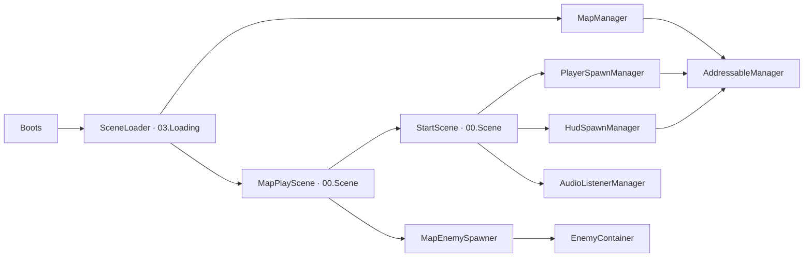

# 게임 시작과 반환

## 책임과 폴더

외부 호출이 없는 AudioListenerManager.IsListening과 리소스 개수 조회 속성을 제거했다. 리소스 확인은 기존 GetRefCount·IsBusy와 Editor의 CopyLoadInfo를 사용하며, CopyLoadInfo는 실제 화면에서 읽는 항목만 복사한다. 생성·반환·리스너 전환은 유지했다. 이번 간소화는 컴파일까지 확인했고 Play 확인은 남아 있다.

| 담당 | 위치·책임 |
| --- | --- |
| PlayerSpawnManager·HudSpawnManager | 이 폴더; 플레이어·HUD 원본 요청과 생성 객체 관리 |
| AudioListenerManager | 이 폴더; Start 카메라의 리스너 상태 관리 |
| MapManager·AddressableManager | Resources; 씬 요청 전달과 에셋·씬 핸들·사용 횟수 관리 |
| [SceneLoader](../03.Loading/SceneLoader.cs) | 03.Loading; 씬 정리 → 리소스 반환 → 다음 씬 로드·실행 |
| [GameScene](../00.Scene/GameScene.cs) | 00.Scene; 씬의 Init·Create·Enable·Disable·Release 호출 계약 |
| [StartScene](../00.Scene/Play/StartScene.cs) | 00.Scene/Play; 플레이어·HUD·리스너 담당과 퀘스트 기록 소유 |
| [MapPlayScene](../00.Scene/Play/MapPlayScene.cs) | 00.Scene/Play; 맵의 설정 조회·객체 연결·갱신·정리 |

현재 역할은 생성 담당과 리소스 요청 담당으로 나뉜다. 플레이어·HUD 생성 담당은 `Manager` 이름공간과 `Game.Boot`, `Resources`의 MapManager·AddressableManager는 `Manager` 이름공간과 기존 `Game.Runtime`을 사용한다. 씬 정리·호출 순서는 [SceneLoader](../03.Loading/README.md)가 맡는다. 이전 GameManager·MapMoveManager 경로는 제거되어 더 이상 호출되지 않는다.

## 생성과 반환

입력: MapPlayScene.Create → StartScene.Create → 처리: 첫 진입이면 PlayerSpawnManager.Load·Create·Init과 HudSpawnManager.Load·Create → 출력: Start에 유지할 플레이어·HUD·퀘스트 기록. 이후 진입은 같은 플레이어의 위치만 바꾼다.

MapPlayScene.Enable이 StartScene.Enable을 호출하고 해당 맵의 적·HUD·환경음을 연결한다. `MapPlayScene.Update`는 `Tick`을 통해 StartScene의 플레이어 → 맵 적 → 퀘스트 순으로 갱신한다. 로더와 Boots에는 Tick 전달이 없다.

PlayerSpawnManager·HudSpawnManager는 객체 파괴 완료 후 자신이 받은 원본 요청을 반환한다. MapPlayScene.Release는 적 표시 구독·구역·적 풀·퀘스트 판정·바닥 아이템 풀을 정리하는 동기 함수다. 맵 이동에서는 유지 객체를 반환하지 않는다. 전체 종료는 Boots가 SceneLoader.Release 후 StartScene.Release를 호출한다.

치트의 HUD 삭제는 StartScene.ReleaseHud, 플레이어 삭제는 현재 씬의 실행·플레이어 연결을 끊고 StartScene.ReleasePlayer를 호출한다. 현재 맵 삭제는 기존대로 맵과 유지 객체를 함께 반환한다. 각 반환은 앞선 객체 정리를 기다려 같은 원본 요청을 동시에 줄이지 않는다.

Task는 Addressables 로드·언로드와 Destroy 완료 대기를 위해 사용한다. 로더는 진행 중인 씬 작업 하나, Boots는 겹친 객체 정리 순서를 위한 작업 하나만 보관한다. 시작·이동·HUD·플레이어별 Task 필드와 로더의 IsReady·CurrentScene·PendingLoad 공개 속성은 제거했다.

## HUD와 미니맵 연결

CombatHud 프리팹은 전투 HUD·MinimapInfoController와 자식 미니맵 카메라·플레이어 표시를 함께 소유한다. HudSpawnManager는 기존 HudContainer에 전투 HUD와 미니맵을 등록하고, 활성화 후 양쪽 준비 상태를 확인한다. HudContainer가 같은 플레이어를 두 표시 컴포넌트에 전달하며 미니맵 카메라·영역 표시의 세부 동작은 UI에 둔다. ReleaseHud·ReleasePlayer·전체 반환·시작 실패는 HudContainer.Dispose를 거쳐 미니맵 구독·화면·실행용 RenderTexture를 정리한 뒤 HUD 객체와 원본 요청을 반환한다.

## 확인과 남은 작업

SceneLoader 분리·폴더 이동 후 Unity 재컴파일 성공을 확인했다. Task 저장 필드 두 개, 제거 클래스 호출 없음과 씬 스크립트 GUID 유지·이름공간 연결을 확인한다. 이번 변경 후 Play 왕복 이동·치트 반환·빌드·메모리 프로파일링은 미수행이다. 이전 단계 실행 기록은 [세션 기록](../../../Docs/Work/last-session.md)에 둔다.
