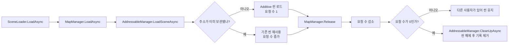

# 맵 리소스 로딩

## 씬 전환 진입점

[SceneLoader](SceneLoader.cs)는 `Loading` 이름공간과 Game.Runtime 어셈블리를 사용한다. 게임 시작에는 `SceneLoader.Create(ConstantValid.StartSceneName)`으로 상주 씬 이름을 전달하고 `LoadAsync(gameData.StartMap)`을 호출한다.

```csharp
await SceneLoader.Instance.LoadAsync(ConstantValid.UnderGroundMapAddress);
```

입력은 맵 주소다. 현재 GameScene.Disable·Release → 자신의 씬 요청 반환·사용하지 않는 리소스 정리 → 다음 씬 로드·활성 씬 지정 → GameScene.Init·Create·Enable 순서다. 로더는 플레이어·HUD·퀘스트를 참조하거나 갱신하지 않는다. 현재 씬·소유 주소·복귀 씬 이름과 진행 중 작업 하나만 보관하며, 종료 여부 두 값으로 로딩·반환 중 실행을 제어한다.

씬 실행 계약은 [GameScene](../00.Scene/GameScene.cs), 현재 플레이 구성은 [MapPlayScene](../00.Scene/Play/MapPlayScene.cs)에 있다. 동기식 객체 정리는 void이고 실제 로드·언로드만 Task로 기다린다. 이는 별도 스레드를 만드는 코드가 아니다.

## 리소스 관리자 연결

MapManager·AddressableManager는 [02.Manager/Resources](../02.Manager/Resources)에 옮겼고 Manager 이름공간·기존 Game.Runtime 소속을 사용한다. GUID와 핸들·사용 횟수 관리 동작은 유지한다.

[AddressableManager.Instance](../02.Manager/Resources/AddressableManager.cs)는 일반 에셋과 씬의 실제 로딩·핸들·사용 횟수·해제를 관리하는 싱글톤이다. 프리팹 원본, Sprite, AudioClip, ScriptableObject 등 `UnityEngine.Object` 에셋이 대상이며, 생성된 GameObject 인스턴스의 수명은 호출자가 관리한다. 씬 로딩은 Boots → SceneLoader → MapManager → AddressableManager 순서다. MapPlayScene이 StartScene을 통해 PlayerRoot와 CombatHud를 준비한다.

입력: `LoadAssetAsync<T>(key)` → 처음 요청이면 Addressables로 로드하고 핸들을 보관, 같은 키를 다시 요청하면 캐시된 에셋을 반환 → 요청마다 사용 횟수 증가. `Release(key)`는 횟수만 줄이고, `CleanUpUnusedAssets()`가 0인 핸들을 Addressables에 반환한다. 호출자는 성공한 로드마다 Release를 한 번 맞추고, 생성한 인스턴스를 정리한 뒤 원본 프리팹을 반환한다.

현재는 로딩·정리 작업 중 다른 요청을 거절한다. 작업 완료를 `await`한 뒤 다음 요청을 보낸다. 로딩 실패 시 핸들을 반환하고 캐시에 넣지 않으며, 같은 키를 다른 타입으로 요청하면 오류를 낸다. 키 자동 변환과 씬 전환 시 자동 정리는 없다.

## 플레이어와 전투 HUD 프리팹

두 프리팹은 각각 별도 Addressables 그룹에 등록되어 있다. 주소는 프리팹 이름과 같게 유지한다.

| 그룹 | 주소 | 프리팹 |
| --- | --- | --- |
| Player | `PlayerRoot` | [PlayerRoot.prefab](../Runtime/Characters/PlayerRoot.prefab) |
| CombatHud | `CombatHud` | [CombatHud.prefab](../18.GUI/CombatHud/CombatHud.prefab) |

각 그룹은 기존 Common의 번들·콘텐츠 갱신 설정만 복사해 만들었다. `LoadAssetAsync<GameObject>(주소)`로 원본을 로드하고, 사용이 끝나면 `Release(주소)`와 `CleanUpUnusedAssets()`로 반환한다. StartScene이 PlayerSpawnManager·HudSpawnManager를 통해 비활성 부모 아래 생성·초기화·표시 연결을 마친 뒤 활성화한다. 반환 시 객체 파괴 완료를 기다린 뒤 원본 핸들을 정리한다. 실제 번들 빌드는 별도 검증이다.

Cheat 창의 등록 목록에서 `PlayerRoot` 또는 `CombatHud`를 선택해 생성·삭제와 요청 반환을 확인할 수 있다.

## Addressables Cheat 창에서 확인

같은 창의 플레이어 체력·이동과 현재 맵 아이템 탭은 [치트 안내](../90.Editor/README.md)를 참고한다. 아이템 목록의 현재 맵은 BootsCheat → SceneLoaderCheat로 조회하며, Addressable 탭에서 임의로 추가 로드한 씬을 현재 게임 맵으로 사용하지 않는다.

`Tools > Cheat > 치트 창`의 왼쪽 **Addressable** 탭에서 생성·삭제와 로드 현황을 선택한다. 상단 제목 영역 없이 목록 공간을 사용한다. [UXML](../90.Editor/AddressableSpawnWindow.uxml)과 [USS](../90.Editor/AddressableTools.uss)로 구성하며 Unity의 밝은·어두운 스킨에 맞춰 표시한다.

1. Start 씬에서 Play하고 **생성 · 삭제** 탭의 등록 목록에서 항목을 선택한다.
2. **생성**을 누르면 프리팹은 복제하고, 씬은 Additive로 로드하며, 그 밖의 에셋은 원본을 로드한다.
3. 로드된 항목은 행 오른쪽 끝에 **참조 횟수**를 표시하며, 빨간 **삭제** 버튼은 전체 참조가 남아 있으면 활성화한다. 선택 아래에는 함께 정리할 사용 객체를 표시한다.
4. **로드 현황**에서 현재 보관된 리소스와 참조 횟수·핸들 상태를 확인하고, **선택한 리소스 삭제**도 같은 반환 경로를 사용한다. 참조가 0이거나 로드·정리 중이면 두 삭제 버튼 모두 비활성화한다.

입력: 등록 항목 선택 → 처리: 기존 AddressableManager로 순차 로드·생성 → 결과: 객체와 요청 수 표시. 삭제는 객체 파괴 완료 후 요청을 반환하고 사용 횟수 0인 핸들을 정리한다. 이미 게임이 사용하는 주소를 생성하면 요청이 추가된다. 삭제는 창 소유 객체·요청을 먼저 하나 반환하고, 창 소유 요청이 없으면 BootsCheat를 통해 StartScene의 개별 반환 또는 씬 로더와 유지 객체의 전체 반환을 호출한다. 게임 HUD 삭제는 HUD만, 플레이어 삭제는 플레이어와 연결된 HUD·몬스터·풀, 현재 맵 삭제는 맵과 게임 플레이어·HUD·몬스터·풀을 함께 정리한다. 원본 참조 수를 강제로 줄이지 않으며 다른 소유자의 요청은 유지한다. 현재 호출자인 게임·치트 외에 새로운 소유자를 추가하면 그 소유자의 객체 정리 경로도 연결해야 하며, 연결되지 않은 소유자는 삭제 시 이유를 표시한다. 같은 씬을 다시 요청해도 씬을 중복 생성하지 않는다.

일반 프리팹은 원점에 생성한다. PlayerRoot·CombatHud 복제는 게임 전용 초기화가 필요하므로 비활성으로 둔다. 선택 항목 아래에 전체 참조 수와 삭제 범위를 표시한다. 창을 닫으면 창 소유 요청을 역순 정리하며 Play 종료 중에는 새 비동기 씬 해제를 시작하지 않는다.

로드 현황은 Editor 전용 `AddressableManager.CopyLoadInfo`로 0.5초마다 갱신한다. 관리자를 새로 만들거나 실제 에셋·핸들을 참조하지 않는다. `사용 중`은 요청이 남은 상태, `정리 대기`는 요청 0이지만 핸들을 보관한 상태이며 정리 후 목록에서 사라진다. 수치는 프로젝트 로더의 요청 수이며 Addressables 내부 참조 수나 바이트 단위 메모리가 아니다. 최초 로딩 중인 항목은 성공 후 목록에 나타난다.

기존 치트 소유 요청의 생성·삭제·창 닫기 정리는 이전 Play에서 확인했다. 전체 참조 삭제 연결 후 Unity 컴파일 성공과 Console 오류·경고 0을 확인했다. HUD 단독 삭제, 플레이어와 HUD 삭제, 현재 맵 삭제, 치트·게임 공유 참조의 순차 반환은 이번 변경 후 Play에서 다시 확인해야 한다. 실제 번들·Player 빌드는 미실행이다.

[MapManager.Instance](../02.Manager/Resources/MapManager.cs)는 맵 요청을 AddressableManager에 전달하는 일반 C# 싱글톤이다. LoadAsync → LoadSceneAsync, Release → ReleaseScene, CleanUpAsync → CleanUpUnusedScenesAsync로 위임한다. 핸들과 사용 횟수를 중복 보관하지 않는다. Manager 이름공간과 Game.Runtime 어셈블리를 사용한다. 두 로딩 객체의 생성자는 private이며, 각 호출자는 자신이 요청한 사용 횟수만 반환한다. Cheat 창도 자신이 성공한 로드 횟수를 별도로 기록하며, 게임 소유 요청 삭제는 게임의 반환 메서드에 위임한다.

맵 전체를 불러오는 짧은 키는 [MapConstant.cs](../04.Core/Constant/MapConstant.cs)에 이미 정의되어 있다. `ConstantValid.GroundMapAddress`는 `Ground`, `ConstantValid.UnderGroundMapAddress`는 `UnderGround`이며 각 키는 해당 씬 전체를 가리킨다. 같은 키로 `LoadAsync` → `Release` → `CleanUpAsync`를 호출한다. 씬 로딩은 그 씬이 참조하는 리소스를 함께 로드하며, 씬 해제 후에도 다른 사용자가 참조하는 공용 리소스는 유지될 수 있다. 씬 밖에서 별도로 로드한 에셋은 해당 호출자가 반환한다.

| 항목 | 의미 |
| --- | --- |
| AddressableManager.loadedScenes | Address별 씬 로딩 핸들과 refCount |
| GetRefCount(address) | 해당 씬의 사용 요청 횟수 |
| IsBusy | AddressableManager의 일반 에셋·씬 로딩·정리 공통 진행 상태 |

입력: LoadAsync(Address) → 최초 요청은 Additive 로딩, 재요청은 기존 씬 반환 → refCount 증가.
Release(Address)는 사용 횟수만 줄이고 0 아래로 내려가지 않는다. CleanUpAsync는 AddressableManager.CleanUpUnusedScenesAsync로 위임해 사용 0인 씬을 해제하고 loadedScenes에서 제거한다. refCount는 사용 요청 횟수이며 Addressables 내부 참조 수와 별개다.



게임에서 이미 로드한 항목도 같은 로더 조회로 표시한다. 새 Play에서 치트 생성 없이 Ground·PlayerRoot·CombatHud의 참조 1을 확인했다. 이번 UI 변경 후 컴파일과 플레이어 탭 이동은 확인했으며, 최종 반복 삭제 재검증은 Unity 연결 중단으로 완료하지 못했다.

## 호출 예시

맵 씬 이름과 Addressables 주소는 같게 유지한다. 편집기 조명 도구도 `GroundMapAddress`·`UnderGroundMapAddress`로 열린 씬을 조회하며, 별도의 맵 이름 상수는 두지 않는다.

```csharp
var maps = MapManager.Instance;
await maps.LoadAsync(ConstantValid.GroundMapAddress); // 씬 1개, 참조 1
await maps.LoadAsync(ConstantValid.GroundMapAddress); // 씬 1개, 참조 2
maps.Release(ConstantValid.GroundMapAddress);         // 참조 1
await maps.CleanUpAsync();                           // 사용 중이므로 유지
maps.Release(ConstantValid.GroundMapAddress);         // 참조 0
await maps.CleanUpAsync();                           // 씬 해제, 씬 0개
```

리소스 요청 예시의 호출자는 Manager와 Core를 사용하며 씬 전환은 Loading.SceneLoader를 사용한다. Unity 메인 스레드에서 작업 완료를 await한 뒤 다음 요청을 보낸다. 작업 중 다른 요청은 예외로 거절한다. 로딩 실패 시 핸들을 반환하고 캐시에 추가하지 않는다.

같은 씬은 MapManager.Instance를 통해 관리하고 외부 SceneManager로 임의 해제하지 않는다. 사용을 끝낼 때 성공한 LoadAsync마다 Release를 맞추고 CleanUpAsync 완료를 기다린다. Domain Reload를 꺼도 Play 시작마다 싱글톤 참조는 초기화된다. SceneLoader는 씬 전환·요청 반환을, 각 맵 코드는 플레이어 배치·환경음·객체 실행을 맡는다.

## Unity에서 확인

Start에는 Boot와 MainCamera를 둔다. Start를 단독으로 열고 Play하면 Boots가 SceneLoader.LoadAsync에 첫 맵 주소를 전달하고 맵 코드가 StartScene을 통해 PlayerRoot·CombatHud를 준비한다. SceneLoader·MapManager는 Inspector에 붙이지 않는다.

Ground·UnderGround의 Addressables 등록은 유지한다. 준비 완료 시 씬 캐시 1·에셋 캐시 2이고 Ground·PlayerRoot·CombatHud 요청은 각각 1이다. 치트의 현재 맵 삭제 또는 실행 중 Boot 파괴 후 이번 실행의 요청과 객체가 정리되는지 확인한다. Play 종료 중에는 새 비동기 해제를 시작하지 않는다. 출구 트리거는 미연결이며 새 테스트 코드는 만들지 않는다.

Start Play에서 위 준비 수치와 명시적 반환·로딩 직후 반환·Boot 파괴 후 세 주소 요청 및 에셋·씬 캐시 0을 확인했다. 부분 플레이어 초기화 실패 시에도 요청이 반환됐다. 실제 Addressables 번들 빌드와 모든 로드 실패 조합은 미검증이다.

SceneLoader와 폴더 이동 후 Unity 재컴파일은 성공했다. 위 Play 기록은 이전 단계이며 이번 변경 후 실제 씬 왕복·치트 반환·빌드는 실행하지 않았다.
