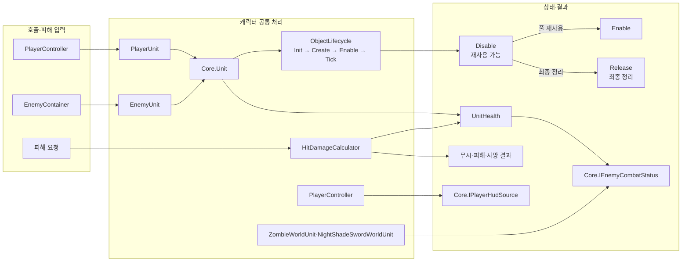

# 캐릭터 공통 규칙

플레이어와 적이 함께 사용하는 체력, 생명주기, 피해 계산과 피격 규칙을 둔다. 특정 캐릭터의 입력이나 AI는 해당 엔티티 폴더에서 처리한다.

피해 요청은 실제 판정이 읽는 피해·위치·밀침 방향만 전달한다. 읽히지 않는 PlayerHitSurface·HitSurface와 공격 보정의 미사용 조회를 제거했다. EnemyHitResult의 Ignored·Killed는 static readonly 고정 값이며 피해 반응은 기존 생성자로 조합한다. 방패/몸통 접촉 처리 순서와 피해·사망 이벤트는 유지했다. 이번 간소화는 컴파일까지 확인했고 Play 확인은 남아 있다.

[IPlayerHudSource](IPlayerHudSource.cs)는 UI가 플레이어 구현을 참조하지 않도록 표시 수치·아이템 조회·안내·변경 알림을 정의한다. 실제 값과 이벤트 연결은 PlayerController의 PlayerHudSource partial이 담당하며, Core는 게임 상태나 표시용 복사본을 보관하지 않는다.

[IEnemyHudSource](IEnemyHudSource.cs)는 적 활성 목록과 활성·비활성 알림을 제공하고, [IEnemyCombatStatus](IEnemyCombatStatus.cs)는 적의 전투 표시 값·알림을 제공한다. EnemyContainer와 각 적 실행 객체가 구현하며 HUD는 생성·풀 반환 기능을 참조하지 않는다. 기존 목록·값·이벤트를 사용하고 Core에 새 상태 저장소를 만들지 않는다.

## 폴더 구성

생명주기·체력·전투·설정 코드는 `04.Core/Character`에 모으고 모두 `Core` 이름공간을 사용한다. 상위 `04.Core/Game.Runtime.asmdef`에 포함되므로 별도 asmref는 두지 않는다. 엔티티별 입력·행동 선택은 각 엔티티가 소유한다.

| 폴더 | 설명 |
| --- | --- |
| `Lifecycle` | `Unit`의 캐릭터 공통 생명주기와 사망 여부 |
| `Health` | `UnitHealth`의 체력과 변경·사망 알림 |
| `Config` | 체력과 경직 기준값을 공유하는 생명 설정 |
| `Combat/Attack` | 공격 피해 데이터와 공격 대상 보정 |
| `Combat/Hit` | 피해 계산, 경직 누적, 피격 반응과 타격 정지 |

플레이어 전용 `PlayerUnit`은 `../../10.Player/Lifecycle`, 적 전용 `EnemyUnit`은 `../../11.Enemy/Shared/Lifecycle`에 둔다. 플레이어·적 피해 요청·결과·수신 인터페이스와 방패·효과 계약은 `Combat`, 귀환 구역 계약은 `Area`에 둔다. 타격 파티클 구현은 `../../15.Effects/Combat`에서 `ICombatHitEffects`를 구현한다. UI는 `IPlayerHudSource`·`IEnemyHudSource`·`IEnemyCombatStatus` 계약만 읽는다.

## 동작 흐름

소유자의 호출 → `Core.ObjectLifecycle`의 상태 확인 → `Unit`의 체력·활성화 번호 처리 → 각 캐릭터의 전용 처리 순서다. 플레이어는 PlayerController, 적은 EnemyContainer가 호출한다.

소유자가 `Tick`을 호출하고, 풀 재사용은 `Disable` 뒤 `Enable`로 이어진다. 완전히 버릴 때는 비활성화한 뒤 `Release`한다. 피해 계산기는 체력 변화를 적용해 무시·피해·사망 결과를 돌려준다.

- `Init`: 생성자로 전달받은 참조·설정에 대한 초기화 단계다. 현재 Unit은 별도 초기화 콜백이 없다.
- `Create`: OnUnitCreate로 내부 생성 작업을 실행한다.
- `Enable`: 활성화 번호를 올리고 자원 준비 후 전용 활성화 작업을 호출한다.
- `Tick`: 해당 유닛의 갱신 작업을 호출한다.
- `Disable`: 전용 비활성화 작업을 호출한다.
- `Release`: OnUnitRelease와 체력 이벤트 해제를 처리한다. 먼저 소유자가 Disable해야 한다.

공통 단계 정의는 [Core 안내](../README.md)를 따른다. Core가 Init·Create·Enable·Tick·Disable·Release와 상태를 제공한다. 단계 사이 자동 호출은 없으며 Unit.Dispose만 IDisposable 호환용으로 Disable → Release를 연결한다. 별도 생명주기 관리자는 없다.

`EnemyUnit`은 활성화할 때 체력을 초기화한다. 기본 `Unit` 자체가 모든 캐릭터의 체력을 매번 초기화하는 것은 아니다. `ActivationSequence`는 같은 풀 객체가 다시 활성화된 경우를 구분하는 번호다.

## 먼저 읽을 코드

- [ObjectLifecycle.cs](../ObjectLifecycle.cs): 객체 하나의 생명주기 순서와 중복 호출 방어.
- [Unit.cs](Lifecycle/Unit.cs): 공통 호출 순서와 확장 지점.
- [EnemyUnit.cs](../../11.Enemy/Shared/Lifecycle/EnemyUnit.cs): 적 재활성화 시 체력 초기화.
- [UnitHealth.cs](Health/UnitHealth.cs): 현재 체력과 변경·사망 알림.
- [HitDamageCalculator.cs](Combat/Hit/HitDamageCalculator.cs): 피해 적용 결과.
- [StopPoint.cs](Combat/Hit/StopPoint.cs): 경직 수치 누적과 회복.

## 변경 후 확인

Core/Character 이동 후 Unity 컴파일 성공, Console 오류·경고 0을 확인했다. 공용 C# 9개는 기존 Game.Runtime 어셈블리에 포함되고 PlayerUnit·EnemyUnit의 기반 타입은 Core.Unit으로 연결된다. 이름공간·using을 제외한 C# 본문과 이동한 meta 17개의 내용·GUID는 동일하다. 상위 asmdef에 포함되어 중복되는 Game.Runtime.asmref와 그 meta만 제거했다. 이번 이동 후 Play 동작과 빌드는 다시 실행하지 않았다.

여섯 단계 통일 후 Unity 컴파일을 확인했다. 이번 변경의 Play 검증과 적 풀 재사용은 미실행이다. 이전 공통화 단계의 실행 결과를 이번 변경의 검증으로 간주하지 않는다. 별도 임시 스크립트·관리자·분리 계층·생명주기 치트는 두지 않는다.

공통 피해·생명주기를 바꾸면 플레이어, 좀비, NightShade에 모두 영향이 갈 수 있다. Unity에서 피해, 사망, 비활성화와 풀 재사용을 구분해서 확인한다. 특정 적의 공격 선택 규칙은 이 폴더에 넣지 않는다.

관련 문서: [플레이어](../../10.Player/README.md), [적](../../11.Enemy/README.md).
