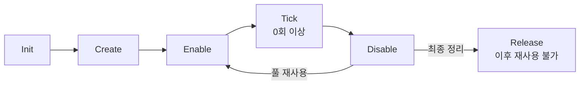

# 공통 기반

## 기능 사이의 계약

Character/Combat에는 피해 요청·결과·수신, 방패 표시, 타격 효과 인터페이스를 둔다. Character/Area는 적 귀환 구역 계약, Interaction은 상호작용 요청·안내·강화 항목, Item은 아이템 정의·종류를 둔다. 이 계약은 엔티티 구현을 참조하지 않는다. 다른 기능을 연결하는 실행 순서는 Scene·Manager가 소유한다.

`ObjectLifecycle`은 일반 C# 객체 하나의 생명주기 순서와 중복 호출을 처리한다. 싱글톤·등록 목록·자동 갱신 기능은 없으며 소유자가 직접 호출한다. `Singleton<T>`와 공통 상수는 기존 역할을 유지한다.

[Character](Character/README.md)에는 플레이어·적이 공유하는 Unit·체력·피해 계산·경직·타격 정지 코드를 모은다. 하위 폴더도 `Core` 이름공간을 사용하며, 입력·AI·공격 선택 같은 엔티티 전용 규칙은 각 엔티티 폴더에 둔다.

[Constant/MapConstant.cs](Constant/MapConstant.cs)는 StartSceneName과 맵 주소, [Constant/GameAddressConstant.cs](Constant/GameAddressConstant.cs)는 PlayerRoot·CombatHud 주소를 `ConstantValid` partial 클래스에 정의한다. 로드·반환·치트 조회에서 같은 주소 상수를 사용한다. SceneLoader도 기존 `Singleton<T>`의 등록·조회·해제를 사용하며 Create에서 준비한 인스턴스만 Instance로 제공한다.

## 호출 흐름

생명주기·싱글톤·상수 코드 모두 `Core` 이름공간을 사용한다.

Init → Create → Enable → Tick → Disable → Release의 여섯 단계다. Init은 외부 참조·설정 준비, Create는 내부 객체·자원 생성, Enable은 활성화, Tick은 갱신, Disable은 비활성화, Release는 자원 정리와 사용 종료다. 필요한 OnInit·OnCreate·OnEnable·OnTick·OnDisable·OnRelease만 구현한다. 프레임 처리가 없는 객체는 Tick을 호출할 필요가 없다.

각 단계는 자신의 On 콜백만 실행하며 다른 단계를 자동 호출하지 않는다. 활성 상태의 Release는 거절하므로 소유자가 Disable → Release를 명시한다. Release 후 재초기화·재생성·재활성화는 거절한다. 재사용은 Disable → Enable로 처리한다. Unity GameObject 파괴와 Addressables 반환은 소유자가 담당한다.

중복 호출은 무시하고 Init 전 Create, Create 전 Enable, 해제 후 재실행은 거절한다. 재진입 방지를 위해 상태는 콜백 전에 기록한다. 콜백 실패는 호출자에게 전달하며 자동 정리를 실행하지 않는다. 호출자는 실패한 객체를 계속 사용하지 않고 필요한 정리를 요청해야 하며 정리 콜백은 부분 초기화 상태를 처리해야 한다.

## 현재 연결

`ObjectLifecycle`은 각 엔티티 객체가 상속하는 생명주기다. `EnemyContainer`는 맵의 적 목록·풀을 소유하고 각 엔티티의 생명주기를 호출한다. 컨테이너 자체에는 `ObjectLifecycle`을 상속하거나 별도 생명주기 객체를 붙이지 않는다.

Unit이 ObjectLifecycle을 상속한다. 참조는 기존 생성자로 전달받고, 소유자인 PlayerController·EnemyContainer가 Init → Create를 명시한다. 내부 생성은 OnUnitCreate, 자원 정리는 OnUnitRelease로 전달한다. 종료는 소유자가 Disable → Release를 요청한다. Unit.Dispose는 IDisposable 호환용으로만 Disable → Release를 연결한다. 퀘스트와 다른 객체는 이번 변경에서 이전하지 않는다.

컴파일·실행 확인 결과는 [캐릭터 안내](Character/README.md#변경-후-확인)를 따른다.
