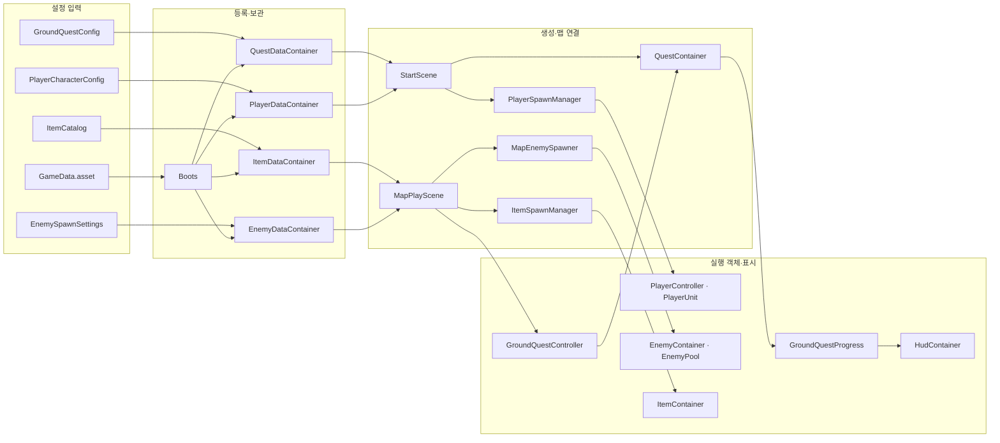

# 게임 데이터

## 입력 → 처리 → 사용

Start 씬의 Boots.gameData → Player·Enemy·Item·QuestDataContainer.Create → StartScene·MapPlayScene → 각 엔티티의 Init·SetData·Connect 순서다. ScriptableObject는 씬 참조로 미리 로드되며 네트워크 요청이나 저장 파일은 사용하지 않는다.

## 종류별 보관자

| 컨테이너 | 보관·조회 |
| --- | --- |
| PlayerDataContainer | Config: 플레이어 설정 |
| EnemyDataContainer | GetEnemy(id): 이름별 적 설정 |
| ItemDataContainer | Catalog: 아이템 정의·프리팹 목록 |
| QuestDataContainer | Ground: 지상 퀘스트 설정 |

네 컨테이너는 각각 Singleton으로 등록하고 해제하며 서로를 참조하지 않는다. GameData.asset은 Boot의 Inspector 입력 목록이다. 시작 맵 주소는 Boots가 SceneLoader.LoadAsync에 전달하고, 플레이어·HUD 주소는 StartScene이 준비한 생성 담당이 보관한다. EnemyContainer·ItemContainer·QuestContainer는 실행 객체·진행 상태를 관리하는 기존 컨테이너이며 데이터 컨테이너와 역할이 다르다.

## 수정할 에셋

`Tools > Data > 게임 데이터`의 왼쪽에서 네 데이터 컨테이너 중 하나를 선택한다. Play 전에도 선택한 GameData의 등록 예정 원본·연결 ScriptableObject를 볼 수 있으며 검색과 읽기 전용 상세 보기를 제공한다. 실행 중에는 BootsCheat가 선택한 컨테이너의 실제 원본만 조회해 `보관 중`·`연결 사용`·`미사용`을 구분한다. 다른 컨테이너의 참조는 해당 사용 상태에 포함하지 않으며, 등록 목록에 없는 실제 보관 원본도 표시한다. EnemyDataCheat는 적 사전의 원본 목록만 Editor에 제공한다. [데이터 창 사용법](../90.Editor/README.md#data-창)을 참고한다. 컴파일과 네 컨테이너의 미실행 목록 전환은 확인했으며 Play 중 상태 전환은 아직 확인하지 않았다.

| 정보 | 위치 |
| --- | --- |
| 시작 맵·플레이어·HUD 주소, 전체 데이터 참조 | [GameData.asset](GameData.asset) |
| 플레이어 이동·전투·타깃·공격 설정 | [PlayerCharacterConfig.asset](../10.Player/Configs/PlayerCharacterConfig.asset) |
| 좀비 수치 | [ZombieConfig.asset](../11.Enemy/Zombie/Configs/ZombieConfig.asset) |
| NightShade 수치 | [NightShadeSwordEliteConfig.asset](../11.Enemy/NightShade/Configs/NightShadeSwordEliteConfig.asset) |
| 적 프리팹·설정·풀 크기 | 각 적의 EnemySpawnSettings 에셋 |
| 아이템 정의·프리팹 | [ItemCatalog.asset](../12.Item/Prefab/ItemCatalog.asset) |
| 지상 퀘스트의 책·스크롤 | [GroundQuestConfig.asset](../16.Quest/GroundQuestConfig.asset) |

적 목록의 키는 EnemySpawnSettings 에셋 이름이다. 맵의 EnemyZoneController.enemyId에 같은 이름을 지정한다. 이름을 바꾸면 목록과 맵 설정도 함께 바꾼다. 적 Config에는 해당 프리팹과 맞는 설정 타입을 지정한다.

각 컨테이너는 자기 종류의 설정만 보관하고 조회한다. 맵별 배치나 엔티티 행동은 결정하지 않는다. 엔티티는 전역 컨테이너를 직접 조회하지 않고 필요한 설정을 전달받는다. 현재 체력·가방·강화·퀘스트 진행은 실행 객체에 있으며 원본 에셋에 저장하지 않는다. Boots는 게임 객체 반환이 끝난 뒤 데이터 컨테이너의 참조와 전역 등록을 비운다.

## 확인과 남은 작업

이후 플레이어·HUD 생성 담당을 분리했으며 해당 변경은 컴파일까지만 확인했다. 아래 실행 결과는 분리 전 데이터 연결 단계의 결과다. 최신 호출 순서는 [진입점 안내](../01.Boot/README.md)를 따른다.

- Unity 6000.3.9f1의 Start Play에서 네 데이터 컨테이너 준비와 설정 전달을 확인했다. 플레이어 이동 설정은 걷기 2.8·달리기 5.5이며, 실제 공격 상태의 첫 공격 데이터는 원본 에셋과 같은 참조로 피해 10·스태미나 비용 10을 보관한다. 좀비 설정도 전달한 원본과 같고 최대 체력 100인 적 10개가 생성됐다.
- W 입력으로 약 2초간 실제 이동을 확인했다. 기존 피격 치트로 플레이어 체력 90 → 80과 HUD 80/100을 확인했고, 설정 피해 10을 적의 TakeHit에 전달해 체력 100 → 90을 확인했다. 이번 확인은 공격 애니메이션·충돌 판정 전체의 재검증과 구분한다.
- 실제 TryInteract API로 책 획득 → 교환 → FindBook·ExchangeBook·ReachExit 순서와 HUD 완료 표시를 확인했다. 물리적 접근·상호작용 키 입력은 이번에 확인하지 않았다.
- 치트와 같은 Boots.DeleteResource API로 HUD → 플레이어 → Ground를 반환했다. 생성 객체·미니맵 실행 텍스처·세 주소 요청이 정리됐고, 이어 실행 중 Boot를 파괴했을 때 네 데이터 컨테이너의 보관 참조와 전역 등록이 모두 비워졌다. Play 재시작에서도 데이터 네 종류와 게임 객체가 다시 준비됐다.
- 첫 실행에서는 에디터에 열린 Start의 gameData가 비어 시작에 실패했다. 디스크의 씬 참조는 정상이었으며 열린 씬을 Temp에 보존하고 Start를 다시 연 뒤 정상 시작했다. 실행 중 조회 도구의 Pipeline 시간 초과는 게임 오류와 구분했다. 마지막 재시작의 compilationFailed=false·Console 오류 및 경고 0을 확인했으며 로그를 수동으로 지우지 않았다.
- 객체·컨테이너·로드 요청의 정리를 확인한 범위다. 메모리 프로파일링·번들/Player 빌드는 수행하지 않았다. Ground 출구 판정 영역은 미지정이며 출구 완료·맵 전환은 이번 검증 범위에 포함하지 않았다.
