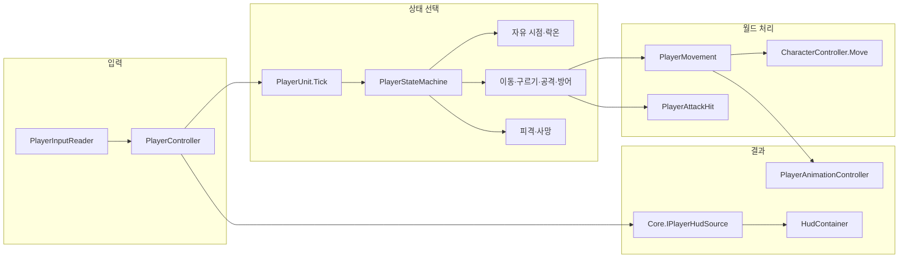

# 플레이어

## HUD에 제공하는 값과 알림

[PlayerHudSource.cs](Lifecycle/PlayerHudSource.cs)는 PlayerController의 partial 구현으로 [IPlayerHudSource](../04.Core/Character/IPlayerHudSource.cs)를 제공한다. HUD는 플레이어 내부 객체를 조회하지 않고 체력·스태미나·표시 배율·슬롯별 아이템·상호작용 안내와 활성·변경 알림을 받는다. 값은 기존 객체에서 읽으며 복사해 저장하지 않는다. HUD 구독 시 기존 이벤트에 연결하고 마지막 구독 해제·플레이어 최종 반환 시 끊는다. 입력·전투·가방·강화 계산과 기존 외부 이벤트는 유지한다. 컴파일과 Play에서 피해·스태미나 소비·아이템 획득/교환·안내 표시, 재활성화 시 중복 구독 없음과 반환 후 구독 0개를 확인했다. 실제 입력의 모든 조합·빌드는 미수행이며 상세 범위는 [UI 확인 기록](../UI/README.md#확인과-남은-작업)에 둔다.

## 설정과 기능 경계

실행 설정은 실제로 읽는 값만 보관한다. 중복 최대 체력 조회는 Life.MaxHealth로 통일하고, 미사용 방어 각도 복사·제곱 거리·상태/수량/상호작용 존재 조회·공격 시점 getter를 제거했다. 공격 시점은 기존 CanStartComboAt·CanCancelToRollAt·CanTurnAt이 Inspector 값을 직접 판정한다. 설정 에셋·HUD 계약·체력/가방 이벤트는 유지했다. 이번 간소화는 컴파일까지 확인했고 Play 확인은 남아 있다.

이동속도·공격 등 기존 수치는 PlayerCharacterConfig와 연결된 공격 에셋을 사용한다. 프리팹의 개별 Config 필드 대신 Init(camera, data)로 받는다. 다른 엔티티 구현을 참조하지 않고 Core의 피해 계약·IInteractionActor·IPlayerInteractable·ICombatHitEffects를 사용한다. 아이템 정의도 Core의 데이터 타입을 공유한다. 전역 데이터 컨테이너는 게임 흐름에서만 읽는다.

플레이어의 입력, 이동, 전투, 카메라 전환, 상호작용과 성장 기능을 관리한다. 배치용 프리팹은 [PlayerRoot.prefab](../Runtime/Characters/PlayerRoot.prefab)에 있다.

## 폴더 구성

[PlayerController](Lifecycle/PlayerController.cs)는 초기화를 마친 플레이어 한 명을 Instance로 제공하고 Unity 객체의 등록·활성·해제 경계를 담당한다. StartScene이 소유하는 PlayerSpawnManager가 Addressables 원본 요청·생성 객체를 관리하고 Init에 카메라와 PlayerDataContainer의 설정을 전달한다. 맵 이동에서는 같은 플레이어를 유지하고 TryMoveToPosition으로 위치·이동 상태·카메라 추적을 맞춘다. PlayerUnit은 Unit의 기존 생명주기를 사용한다. 별도 생명주기 관리자나 등록 목록은 없다. HUD·퀘스트는 전달받은 참조로 구독·해제한다. [진입점과 실행 순서](../01.Boot/README.md)를 참고한다.

| 폴더 | 설명 |
| --- | --- |
| `Lifecycle` | `PlayerController`, `PlayerUnit`의 생성·갱신·반환과 사망 상태 |
| `Input` | Input System 입력과 누른 행동 저장 |
| `Movement` | 이동·구르기 상태, 속도·중력·충돌 이동, 자유 시점·락온 방향, 행동 이동 곡선 |
| `StateMachine` | 상위 상태 전환·상태 인터페이스·프레임 입력, `Actions`의 행동 전환·입력 예약 |
| `Combat/Attack` | 공격 상태·설정 타입, `AttackData`의 1~6번 설정, 판정·무기 궤적·효과 |
| `Combat/Block`, `Combat/Hit` | 방어 상태, 피격 상태·방패 판정; 피해 요청·응답 계약은 Core/Character/Combat |
| `Animation`, `Audio` | Animator 파라미터, 애니메이션 이벤트와 효과음 |
| `Camera` | 자유 시점·락온 상태, 대상 탐색·가림 유예, 락온 카메라 제어 |
| `Interaction` | 상호작용 대상 탐지와 실행 |
| `Inventory`, `Stats` | 가방, 스태미나와 능력치 강화 |
| `Config`, `Configs` | 설정 타입과 실제 설정 에셋 |
| `Models` | 모델, 텍스처, 애니메이션 원본·클립·Controller |

상태 파일은 해당 기능 폴더에 모으고 StateMachine에는 전환·연결 약속만 둔다. 기존 스크립트·설정 에셋은 Unity AssetDatabase로 이동해 GUID를 보존했다. 플레이어 이름공간은 엔티티까지만 포함한 `Player`로 통일하며 기능별 구분은 폴더로 한다. 외부 코드는 `using Player;`로 참조하고, Input System의 코드 생성 이름공간도 같은 값을 사용한다. 씬·프리팹·설정의 스크립트 GUID와 직렬화 필드는 유지한다.

## 생성과 갱신 흐름

1. PlayerSpawnManager가 비활성 PlayerObjects 아래에 PlayerRoot를 생성하고 MapScene의 StartArrival 위치·수평 방향을 적용한다.
2. `PlayerController.Init(MainCamera.transform)`이 씬 인스턴스·중복 등록을 검사하고 CreatePlayerObjects를 호출한다. 내부 PlayerUnit.Init → Create 후 Instance를 등록한다. 활성 객체라면 Enable까지 호출한다. PlayerSpawnManager는 비활성 부모 아래에서 호출해 조기 입력을 막는다. 상호작용 감지기의 Unity Start는 유지한다.
3. HUD 연결 후 부모를 활성화하면 `OnEnable` → PlayerController.Enable → PlayerUnit.Enable로 입력이 시작된다. `MapPlayScene.Update` → `StartScene.Tick` → `PlayerController.Tick` → `PlayerUnit.Tick`에서 타격 정지, 상호작용, 상태머신과 스태미나 회복을 처리한다. IsPaused면 PlayerController가 갱신을 건너뛴다.
4. 상태머신이 현재 행동에 맞는 이동·공격·방어·애니메이션 처리를 호출한다.
5. 반환 시 Disable → HUD 구독 해제 → PlayerController.Release → PlayerUnit.Release가 자원을 정리하고 Instance 등록도 지운다. Release는 비활성화를 자동 호출하지 않으므로 PlayerController가 먼저 Disable한다. PlayerSpawnManager가 Unity 객체 파괴 완료 후 원본 요청을 반환한다. 초기화 실패도 같은 정리 경로를 사용하며 해제한 객체는 재초기화하지 않는다.

## 단일 플레이어와 원본 수명

- Instance는 초기화한 플레이어를 제공하는 단순 프로퍼티다. 생성 전·해제 후에는 null이며, 호출자가 필요한 시점에 확인한다. 검색·자동 로드·자동 생성·DontDestroyOnLoad는 하지 않는다.
- 다른 플레이어가 등록되어 있으면 초기화를 거절한다. 같은 객체·카메라의 중복 Init은 재생성이나 재구독 없이 종료한다. 실패한 객체의 Release는 다른 플레이어의 등록에 영향을 주지 않는다.
- Disable은 입력과 행동만 멈추며 Instance·체력·인벤토리·강화 기록을 유지한다. Release는 최종 해제이며 자신의 등록을 지운다. OnDestroy도 Release를 호출한다. 별도 Play 초기화 콜백 없이 매 실행 새 객체를 생성·등록한다.
- 원본 프리팹과 편집 상태의 객체는 등록하지 않는다. Init은 카메라 필드를 바꾸기 전에 이 조건부터 확인한다.
- Unit의 Init·Create·Enable·Tick·Disable·Release 호출은 Core.ObjectLifecycle의 공통 상태 검사로 연결된다. PlayerUnit·입력·상태머신·상호작용의 내부 처리 순서는 유지한다. IsReady는 상호작용 Start 완료를 뜻하지 않는다.
- 싱글톤 참조는 Addressables 핸들이 아니다. 원본 요청과 파괴 완료 대기는 PlayerSpawnManager·AddressableManager의 기존 계약을 따른다.

## 이동 입력이 화면에 반영되는 순서

`PlayerInputReader` → `PlayerMoveState` → `PlayerMovement` → `CharacterController.Move` → 실제 수평 이동 속도 계산 → `PlayerAnimationController.UpdateLocomotion` 순서다.

자유 이동은 카메라 기준, 락온 이동은 대상 기준으로 방향을 계산한다. 가속·감속·반대 방향 전환 가속도를 구분하고, 충돌 후 실제 이동 속도를 걷기·달리기 애니메이션에 반영한다. 구르기와 공격 전진은 애니메이션 진행률에 따른 이동 곡선을 사용한다.

방어 준비 중에는 방어 방향으로 회전하고, 준비가 끝나고 방어 대기 애니메이션에 들어가면 방어 이동을 허용한다. 공격·구르기는 짧은 입력 예약을 사용한다. 발을 지형에 맞추는 IK는 이 이동 처리에 포함되어 있지 않다.

## 실행 객체의 책임

행동별 스태미나 규칙과 달리기 기록은 `Stats/PlayerActionStamina.cs`가 소유하며 수치·회복·이벤트는 기존 PlayerStamina가 맡는다. `Combat/Attack/PlayerAttackHit.cs`는 공격력 배율과 공격 판정기·소리·궤적 실행을 묶는다. 현재 상태·공격 번호 검사는 PlayerStateMachine이 수행한 뒤 이 객체들에 위임한다.

각 행동 상태는 이동·애니메이션·소비·판정 객체를 생성자로 직접 받는다. PlayerActionStateMachine은 입력 예약과 행동 전환만 맡고 공격 준비는 PlayerAttackState, 구르기 준비·무적은 PlayerRollState에 둔다. 시점·피격 상태의 즉시 전환 요청은 IPlayerLookStateChange, 공격 대상 조회는 IPlayerAttackTarget으로 제한하며 두 인터페이스는 PlayerStateMachine이 구현한다. 프레임마다 객체나 위임 함수를 만들지 않는다.

PlayerController는 TryCreatePlayerConfig → TryConnectPlayerComponents → CreatePlayerRuntime → StartPlayerUnit 순서로 준비한다. 공유 실행 객체는 Controller에서 만들고 개별 상태는 PlayerStateMachine에서 연결한다. 기존 Init·Create·Enable·실패 정리·등록 호출 순서는 유지한다.

플레이어 실행 객체는 `PlayerUnit : Unit` 한 단계로 구성한다. 기존 실행 구현과 생성자만 있던 중간 타입을 PlayerUnit으로 합쳤으며, 입력·피격·스태미나·상호작용·해제 로직은 그대로 유지한다. PlayerController.RuntimeUnit, HUD·퀘스트의 이벤트 처리와 강화 코드는 PlayerUnit을 참조한다. Unit의 공통 구현과 Unity 컴포넌트·프리팹 연결은 변경하지 않는다.

## 동작 보존 기준

- 프레임 순서: 타격 정지 시 반환 → 경직 수치 회복 → 사망 분기 → 상호작용 → 구르기·공격·락온 입력 소비 → 상태 갱신 → 공격 범위 검사 → 스태미나 회복. PlayerUnit의 호출 순서를 유지한다.
- 입력 예약은 마지막 행동 하나이며 동시 입력은 구르기가 우선한다. `age > duration`일 때 만료하고 실행에 실패해도 꺼낸 입력은 소비한다. 상태 전환 뒤 같은 프레임에 Update를 다시 부르는 위치도 유지한다.
- 자유 시점은 행동 갱신 뒤 락온을 시도한다. 락온 상태는 해제·대상 상실을 먼저 처리하고 그 프레임의 행동 갱신을 건너뛴다.
- 달리기 공격은 직전 프레임의 실제 달리기로 결정한다. 피격·사망 시에는 달리기 기록만 지우고 소진 후 재시작 대기는 유지한다. 활성화·비활성화는 둘 다 초기화한다.
- 일반 구르기는 비용 가능 확인 → 접지·방향 설정 → 비용 소비, 공격 취소 구르기는 비용 소비 → 방향 설정 순서다. 무적 시작·끝은 기존 애니메이션 이벤트와 종료 경로를 유지한다.
- 이동 수치·곡선·충돌 후 속도·Move 호출 횟수, 공격 1~5타와 달리기 6번·콤보/회전/취소 구간·중복 명중 방지, 방어 준비·방향·동일 비용에서 방어 붕괴·피격/사망 알림 순서를 유지한다.
- Config·입력·Animator·애니메이션 이벤트·프리팹·GUID와 외부 공개 API는 유지한다. 기존 특이 동작 수정은 구조 변경에 포함하지 않는다.

구조 분리 전후 Start 단독 Play에서 Input System에 동일 입력을 전달하고 Unit과 Animator를 1/60초씩 갱신했다. 이동·달리기·구르기·공격·동시 입력·연속 공격·방어의 600프레임 중 12개 지점에서 위치·회전(소수점 4자리), 체력·스태미나·행동 상태·Animator 상태와 진행률이 모두 일치했다. 기능별 파일 이동 후 같은 비교도 일치했다. 실제 프레임 스케줄·카메라 추적·모든 지형의 수동 조작까지 동일하다는 증명은 아니며 남은 항목은 아래에 구분한다.

## 수정 위치 안내

| 수정할 내용 | 시작 파일 |
| --- | --- |
| 이동 속도·회전·스태미나 수치 | [PlayerCharacterConfig.asset](Configs/PlayerCharacterConfig.asset) |
| 이동·충돌 결과 처리 | [PlayerMovement.cs](Movement/PlayerMovement.cs) |
| 이동 상태·구르기 준비와 무적 | [PlayerMoveState.cs](Movement/PlayerMoveState.cs), [PlayerRollState.cs](Movement/PlayerRollState.cs) |
| 걷기·달리기 표현 | [PlayerAnimationController.cs](Animation/PlayerAnimationController.cs) |
| 행동 전환·입력 예약 | [PlayerActionStateMachine.cs](StateMachine/Actions/PlayerActionStateMachine.cs) |
| 상위 상태 전환 | [PlayerStateMachine.cs](StateMachine/PlayerStateMachine.cs) |
| 공격 진행·콤보·대상 보정 | [PlayerAttackState.cs](Combat/Attack/PlayerAttackState.cs) |
| 공격별 설정 | [PlayerAttackData.cs](Combat/Attack/PlayerAttackData.cs), `Combat/Attack/AttackData` |
| 공격 판정 실행·배율 | [PlayerAttackHit.cs](Combat/Attack/PlayerAttackHit.cs) |
| 행동별 스태미나 규칙 | [PlayerActionStamina.cs](Stats/PlayerActionStamina.cs) |
| 방어·피격·사망 | [PlayerBlockState.cs](Combat/Block/PlayerBlockState.cs), [PlayerHitState.cs](Combat/Hit/PlayerHitState.cs), [PlayerDeadState.cs](Lifecycle/PlayerDeadState.cs) |
| 자유 시점·락온·대상 탐색 | [PlayerFreeLookState.cs](Camera/PlayerFreeLookState.cs), [PlayerTargetLookState.cs](Camera/PlayerTargetLookState.cs), [PlayerTargetFinder.cs](Camera/PlayerTargetFinder.cs) |
| 초기 연결·등록 | [PlayerController.cs](Lifecycle/PlayerController.cs) |

## Unity에서 확인

플레이어의 `Test Damage` 메뉴는 같은 Lifecycle 폴더의 [PlayerCheat.cs](Lifecycle/PlayerCheat.cs)에 분리했다. PlayerController의 Editor 전용 partial 선언이므로 별도 컴포넌트 부착 없이 기존 Inspector 메뉴에서 피해 처리를 호출한다.
이번 구조 변경 후 Play에서 기존 TestDamage를 실행해 체력 100 → 90과 HUD 채움 배율 0.9를 확인했다.

치트 창의 플레이어 탭에는 감소량 입력과 체력 감소·피격 처리·즉사를 추가했다. PlayerCheat가 기존 Health.TakeDamage 또는 TryTakeHit에 전달하므로 체력·사망 알림은 기존 경로를 따른다. 아이템 지급·수량 소모도 기존 가방 API를 호출한다. 이번 버튼 추가는 컴파일·창 구성만 확인했으며 실제 Play 실행은 남아 있다. 버튼별 차이와 실습 순서는 [치트 안내](../90.Editor/README.md)를 따른다.

- Start를 단독으로 실행한다. 이동 카메라는 StartScene·PlayerSpawnManager가 전달하며, PlayerRoot 프리팹의 두 시점 카메라·Config·상호작용 컴포넌트를 확인한다.
- Animator, CharacterController, 무기 판정과 방패 판정 연결을 확인한다.
- 걷기·달리기, 벽 앞 이동, 락온 옆걸음, 구르기와 방어 전환을 확인한다.
- 이동 애니메이션의 `MovePlaybackSpeed` 연결과 실제 이동 속도가 함께 반영되는지 확인한다.

관련 문서: [공통 캐릭터](../04.Core/Character/README.md), [아이템](../12.Item/README.md), [게임 생성과 반환](../02.Manager/README.md).

## 확인과 남은 작업

### PlayerUnit 직접 상속

- 실행 로직을 PlayerUnit으로 통합하고 PlayerWorldUnit 파일·meta와 코드 참조를 제거했다. PlayerUnit의 기존 meta GUID는 유지했다.
- Unity 컴파일을 통과했고 타입·필드 이름과 상속 선언, 공백을 제외한 실행 본문과 호출부가 변경 전과 일치함을 확인했다. HUD·퀘스트·강화 연결도 새 타입으로 컴파일된다.
- 이번 통합 후 Play 동작·빌드는 실행하지 않았다. 아래 실행 검증은 이전 단계의 기록이다.

### 이름공간 단축 후 확인한 내용

- 플레이어 코드는 `Player`로 통일했고 외부 참조, 입력 코드 생성 설정, 씬·프리팹·설정 에셋의 타입 표기를 함께 갱신했다. 입력 래퍼 재생성 후에도 같은 이름공간을 유지한다.
- Unity 컴파일 성공, Console 오류·경고 0, PlayerRoot의 누락 스크립트 0과 Config·공격 설정 6개 연결을 확인했다. 이후 데이터 분리 단계에서 Start Play·재시작, 설정 전달, W 이동, 피격 치트의 체력·HUD 갱신, 아이템 획득·교환 API와 반환을 확인했다. 공격 상태의 첫 데이터 참조·피해 10·소비 10을 확인했으며 공격 충돌 판정 전체와 빌드는 이번에 재검증하지 않았다. 아래 동작 검증은 이전 구조 개선 단계의 결과다.

### 이번 구조 개선에서 확인한 내용

- Unity 컴파일 성공(compilationFailed=false), 마지막 Console 오류·경고 0, Start 단독 실행 후 플레이어 준비를 확인했다. 편집 도중의 일시적인 생성자 컴파일 오류, 도구 통신 시간 초과, 의도적인 Config 누락 오류는 이력에 남겼으며 로그를 지우지 않았다.
- 위의 600프레임·12지점 전후 비교 외에 Play 입력으로 달리기 공격 6번, 공격 취소 구르기 비용 25, 구르기 무적 중 Avoided와 종료 후 해제, 정면 Blocked(체력 100·스태미나 75), 남은 스태미나와 같은 방어 비용의 GuardBroken(체력 100·스태미나 0), 이후 피격 상태 복귀를 확인했다.
- 기존 상태머신의 공개 Update에 공격 입력을 전달해 1~5타 연결과 스태미나 100 → 90 → 75 → 55 → 30 → 0을 확인했다. 스태미나 부족 시 구르기·공격 동시 입력이 실행되지 않고 회복 뒤에도 그 입력이 다시 실행되지 않았다. 이 확인은 입력 장치 단계의 수동 조작과 구분한다.
- 기존 EnemyContainer API로 Play 중 좀비를 생성해 락온 획득·이동·해제·재획득·대상 제거를 확인했다. 공격 한 번의 피해는 100 → 90으로 한 번 적용됐다. 확인용 풀은 Dispose했으며 게임 시작에 적 생성 코드를 추가하지 않았다.
- 중복 Init의 같은 Unit 유지, Disable·Enable의 등록·체력·스태미나·인벤토리 유지, 사망 후 공격·구르기 종료와 재활성화 후 사망 유지·치트 이동 거절을 확인했다.
- 이전 GameManager 기반 단계에서 중복 Release가 같은 Task를 반환하고 플레이어·등록·로드 목록을 정리하는지 확인한 기록이다. GameManager는 현재 제거됐다. 최신 씬 정리 경로와 이 항목은 구분하며, 새 SceneLoader 전환 뒤 Play 왕복 확인은 남아 있다.
- 기존 코드·설정 에셋 53개의 GUID를 대조해 누락 0, 이동한 코드·설정 에셋 20개를 확인했다. 설정 에셋 내용 변경 0, PlayerRoot Missing Script 0, 스크립트 .meta 누락 0, README 링크 누락 0이다. 씬·프리팹·입력·Animator·클립·프로젝트 설정을 저장 변경하지 않았다.
- 입력 주입이 에디터 포커스와 갱신 시점에 따라 무시된 실행은 검증 통과로 세지 않았다. 검증 중 사용한 메모리상의 InputSettings 복제본은 원래 설정으로 복구하고 제거했다. 테스트 파일·어셈블리·임시 게임 로직은 추가하지 않았다.

### 남은 확인

벽·경사·낙하와 아날로그 입력의 수동 전후 비교, 달리기 완전 소진 후 재개, 입력 예약 만료 경계·늦은 애니메이션 이벤트·강공격 보호 구간·연속 피격·가림 유예의 모든 조합, 실제 입력을 통한 강화 상호작용, Domain Reload 비활성 재시작과 Player 빌드는 이번 단계에서 모두 재검증하지 않았다. 해당 계산·조건·설정은 기존 구현을 유지했지만 실행 확인 완료로 간주하지 않는다.

### 이전 단계의 확인 기록

Instance를 단순 프로퍼티로 정리하고 Play 초기화 콜백을 제거한 최종 코드에서도 컴파일, 플레이어 1개 생성·등록, 반환 후 Instance null과 플레이어·에셋·씬 요청 0을 확인했다. 이 최종 코드의 Domain Reload 비활성 재시작은 별도로 검증하지 않았다.

Unity 컴파일과 Play에서 단일 등록, 중복 Init의 내부 객체 유지, 비활성화·재활성화의 Instance 유지, 중복 객체·관리자 시작 거절, 원본 프리팹 초기화 거절을 확인했다. 명시적 반환 직후 Instance 해제와 파괴 완료 전 원본 요청 유지, 반환 완료 후 객체·에셋·씬 요청 0을 확인했다. Config를 비운 임시 객체의 초기화 실패 후 미등록·반환 후 재사용 거절·요청 0도 확인했다. 아래는 변경 전 시작 흐름에서 확인한 결과다.

Start 단독 Play에서 초기 체력 100, 이동·회전·카메라 추적, 달리기 소비·회복, 분리한 Space 입력의 구르기 비용 25와 HUD 갱신을 확인했다. TestDamage 후 HUD 90/100과 반환 시 입력·플레이어 제거도 확인했다. 적 실행과 락온 전투의 통합 확인은 다음 단계이며 전체 시작 검증은 [진입점 안내](../01.Boot/README.md#확인과-남은-작업)에 기록한다.
