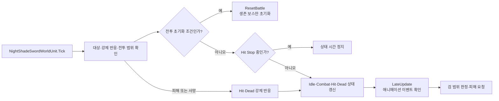

# NightShade 보스

## 설정 전달

읽히지 않는 상태 전달 속성·공격 ID 복사·체력 중복 조회와 곡선 노출을 제거했다. 항상 1인 경직 피해 배율은 원래 피해 값을 직접 전달하며, 피격 시간 선택은 GetPushDuration에서 내부 readonly 필드를 읽는다. 접촉 후보 순서·방어 판정과 행동 선택의 CombatDebug·후보별 점수 기록은 유지했다. 이번 간소화는 컴파일까지 확인했고 Play 확인은 남아 있다.

Boots가 등록한 GameData 목록 → 맵의 enemyId 선택 → EnemySpawnSettings.Config → Controller.SetData(config, target) → 기존 실행 설정 생성 순서다. 플레이어를 씬에서 검색하지 않는다. 추적 Transform과 Core의 피해·사망·효과 계약만 사용하며 다른 기능의 구체 클래스를 참조하지 않는다.

검 공격, 연속 공격과 공격 후 회복 행동을 선택하는 보스 코드와 리소스다. 주요 클래스 이름은 `NightShadeSword`로 시작한다.

## 폴더 구성

모든 하위 폴더의 코드는 `NightShade` 이름공간을 사용한다.

생명주기는 Core의 Init·Create·Enable·Tick·Disable·Release를 따른다. NightShadeSwordWorldUnit의 생성 작업은 OnUnitCreate, 구독 정리는 OnUnitRelease에 있다. 호출 순서는 [EnemyContainer](../Shared/README.md)가 담당한다.

| 폴더 | 설명 |
| --- | --- |
| `Lifecycle` | Controller 참조 연결, 런타임 유닛 생성과 전투 초기화 |
| `Movement` | 이동·회전, 전투 범위, 장애물·바닥 검사와 경로 계산 |
| `StateMachine` | 대기·전투·피격·사망 상태 전환 |
| `StateMachine/States/Combat/Core` | 대상 정보, 전투 기억, 행동 선택과 실행 |
| `StateMachine/States/Combat/Actions` | 단일·연속 공격과 대기·이동 회복 행동 |
| `StateMachine/Runtime` | 실행 중 읽는 설정과 공격 데이터 |
| `Attack` | 검 타격 범위 검사와 공격 소리 |
| `Animation` | Animator 제어와 이벤트 전달 |
| `Config`, `Configs` | 보스 설정 타입과 실제 설정 에셋 |
| `Configs/Attacks` | Light, Heavy, WideSwing, Combo 공격 설정 |
| `Models` | 모델, 동작, 재질, 텍스처와 공격 소리 |

## 동작 흐름

1. Controller가 대상·Animator·검 판정·Config를 연결해 런타임 유닛을 만든다.
2. 활성화할 때 체력과 전투 상태를 준비하고 시작 위치·회전을 기록한다.
3. 대상 거리·방향·시야·높이와 전투 기억을 바탕으로 접근 또는 공격·회복 행동을 결정한다.
4. 이동은 전투 범위와 장애물·바닥을 검사한 뒤 CharacterController에 적용한다.
5. Animator 평가 후 Controller의 `LateUpdate`가 대기 중인 공격 이벤트를 처리하고 검 타격 범위를 검사한다.
6. 피해는 체력·경직·피격 반응으로 반영한다. 전투 이탈에 따른 초기화와 사망에 따른 회수는 구분한다.

## 먼저 읽을 코드와 에셋

- [NightShadeSwordController.cs](Lifecycle/NightShadeSwordController.cs): Inspector 연결과 위치 복구.
- [NightShadeSwordWorldUnit.cs](Lifecycle/NightShadeSwordWorldUnit.cs): Tick, LateUpdate와 ResetBattle.
- [NightShadeSwordStateMachine.cs](StateMachine/NightShadeSwordStateMachine.cs): 상태 전환과 전투 초기화 요청.
- [NightShadeSwordBattleSpace.cs](Movement/NightShadeSwordBattleSpace.cs): 허용 이동 범위와 경로·바닥 검사.
- [NightShadeSwordEliteConfig.asset](Configs/NightShadeSwordEliteConfig.asset): 보스 수치와 공격 연결.
- 배치용 프리팹: [NightShadeSwordElite.prefab](../../00.Scene/Dev/CharacterTest/Prefabs/NightShadeSwordElite.prefab).
- 개발용 소환 설정: [NightShadeTestSpawnSettings.asset](../../00.Scene/Dev/CharacterTest/Settings/NightShadeTestSpawnSettings.asset).

## Unity에서 확인

- Controller의 대상, Animator, 검 HitShape와 Config를 연결한다.
- `battleArea`를 지정하면 해당 BoxCollider 범위를 사용한다. 없으면 시작 위치와 `homeRadius`, 높이 제한을 사용한다.
- 장애물 레이어, 바닥 Collider와 NavMesh 배치를 확인한다. NavMesh가 없을 때도 직접 이동은 시야와 안전한 이동 검사에 통과해야 한다.
- Animator 이벤트와 상태 연결을 확인한다. 검 판정은 LateUpdate에서 실행하므로 Tick에 중복 추가하지 않는다.
- `ResetBattle`은 활성 상태의 살아 있는 보스를 원위치·체력·전투 초기 상태로 되돌린다. 죽은 보스를 이 메서드로 되살리지는 않는다. 풀 재사용 시 초기화는 별도 생명주기다.
- Zone 소환기는 `IZoneEnemy`를 요구한다. 현재 NightShade Controller를 좀비처럼 그대로 연결할 수 있다고 가정하지 않는다.

관련 문서: [적 공통](../Shared/README.md), [캐릭터 공통 생명주기](../../04.Core/Character/README.md).
