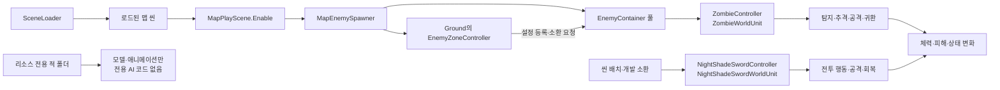

# 적 엔티티

몬스터 종류별 코드·설정·모델을 모은 폴더다. 각 몬스터의 현재 구현 범위는 아래 문서에서 확인한다.

| 폴더 | 현재 폴더 내용 |
| --- | --- |
| [Zombie](Zombie/README.md) | 탐지·추격·공격·귀환·피격·사망 코드, 설정과 배치 프리팹 |
| [NightShade](NightShade/README.md) | 보스 행동 선택, 공격·회복 행동, 전투 범위와 초기화 코드 |
| [DemonSwordsman](DemonSwordsman/README.md) | 검·야수 동작 리소스와 모델 프리팹 |
| [Fighter](Fighter/README.md) | 모델·애니메이션·프리팹, 전용 C# 코드 없음 |
| [Mummy Warrior](<Mummy Warrior/README.md>) | 모델·애니메이션·프리팹과 보관 애니메이션 |
| [Mutant](Mutant/README.md) | 모델·애니메이션·프리팹, 전용 C# 코드 없음 |
| [Undead](Undead/README.md) | 모델·프리팹, 전용 C# 코드 없음 |
| [Shared](Shared/README.md) | 적 공통 전투 정보, 공격 데이터와 경로 안내 |

## 구현된 적의 동작 흐름

공통 코드는 `Enemy`, 좀비는 `Zombie`, NightShade는 `NightShade` 이름공간을 사용한다. 각 몬스터의 하위 기능 폴더도 같은 이름공간을 사용한다.

Zone 소환 코드는 `EnemyContainer.RegisterPool`과 `TrySpawn`을 사용한다. `MapPlayScene`은 플레이어·HUD 활성화 후 MapEnemySpawner로 Ground의 좀비 구역을 연결하고, 플레이어 다음 적을 갱신한다. 맵 이탈·플레이어 반환·Play 종료에서 소환을 멈추고 적·풀을 정리한다. 기존 좀비 배치와 AI는 유지하며 새 연결의 Play 실행은 미검증이다. NightShade의 UnderGround 씬 배치·개발 소환 경로는 별도 연결 범위다.

좀비와 NightShade는 같은 월드 객체 생명주기를 사용하지만 행동 선택과 이동 경로 처리는 각각 구현한다. 모든 몬스터가 같은 AI를 사용한다고 가정하지 않는다.

## 새 적을 연결할 때

1. 전용 Controller에서 Unity 컴포넌트와 설정을 연결한다.
2. 전용 런타임 유닛과 상태·행동 처리를 구성한다.
3. 풀을 사용할 적은 `EnemySpawnSettings`를 `EnemyContainer.RegisterPool`에 등록하고 `TrySpawn`으로 꺼낸다.
4. 피해 수신과 애니메이션 이벤트, 체력 표시 연결을 확인한다.
5. Zone 자동 소환을 사용할 때는 Controller의 `IZoneEnemy` 구현도 확인한다.

리소스 전용 폴더의 프리팹을 배치하는 것만으로 전투 AI가 연결되지는 않는다. 모델 파일과 실제 배치용 프리팹의 위치가 다를 수 있으므로 각 README의 경로를 먼저 확인한다.
