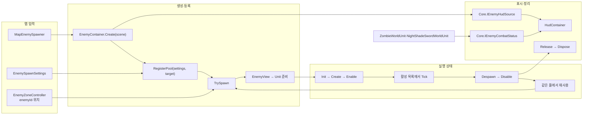

# 적 공통 기능

## 생성 데이터

GameData에 등록한 EnemySpawnSettings는 Prefab·Config·풀 크기를 묶는다. 맵이 enemyId로 선택한 설정과 대상을 RegisterPool에 전달한다. EnemyPool은 새 뷰에 SetData(config, target)를 호출한 뒤 Unit을 준비한다. 컨테이너는 각 맵에 어떤 적을 몇 마리 배치할지 결정하지 않는다. 피해·상호작용·효과 계약은 Core에서 공유한다.

적 종류와 관계없이 사용하는 전투 정보, 공격 데이터와 NavMesh 경로 안내를 둔다. 공격 패턴과 상태 전환은 각 적 폴더가 담당한다.

## 폴더 구성

유닛·전투·공격 설정·길 찾기 등 이 폴더의 코드는 모두 `Enemy` 이름공간을 사용한다.

`EnemyContainer`는 지정한 맵 씬에서 소환되는 몬스터의 등록 목록·활성 목록·풀을 관리한다. 생명주기 상태는 각 `Unit : ObjectLifecycle`이 소유하고 컨테이너는 그 메서드를 호출한다. `Create(scene)`으로 준비하는 싱글톤이며 한 번에 한 씬을 관리한다. SceneLoader → MapPlayScene → MapEnemySpawner가 플레이어 활성화 후 생성하고, 매 프레임 갱신하며, 플레이어 반환·맵 이탈·Play 종료에 정리한다.

[EnemyContainer](EnemyContainer.cs)는 적 등록 시 Unit.Init → Create, 활성화 시 Enable, 갱신 시 Tick, 반환 시 Disable, 등록 제거 시 Release를 호출한다. 풀 재사용은 Disable → Enable이며 기존 풀·목록 관리 방식을 유지한다. [진입점](../../01.Boot/README.md)을 참고한다.

| 위치 | 설명 |
| --- | --- |
| [Core/IEnemyCombatStatus](../../04.Core/Character/IEnemyCombatStatus.cs) | 이름, 체력, 경직, 전투 여부와 변경 알림을 UI에 제공 |
| [Core/IEnemyHudSource](../../04.Core/Character/IEnemyHudSource.cs) | EnemyContainer가 기존 활성 목록·활성/비활성 알림만 HUD에 제공 |
| `Lifecycle` | `EnemyUnit`의 적 생명주기와 재활성화 시 체력 초기화 |
| `../../04.Core/Character/Combat` | 플레이어·적이 공유하는 피해 요청·결과·수신 계약 |
| `AttackData` | 공통 공격 데이터와 공격 선택 관련 설정 |
| `Navigation` | 경로 안내 인터페이스와 NavMeshAgent 기반 구현 |
| `Shaders` | 적 관련 셰이더 리소스 |

## 경로 안내 흐름

대상 위치 입력 → NavMesh 목적지 갱신 → Agent의 이동·회피 방향 읽기 → 적 전용 이동 코드에 방향 반환 순서다. `EnemyNavMeshPathGuide`는 CharacterController가 이동한 실제 위치에 Agent의 계산 위치를 맞춘다. Transform 이동 자체를 Agent에 맡기는 구조가 아니다.

이 경로 안내는 좀비에서 사용한다. NightShade는 전투 범위와 바닥 검사를 포함하는 별도 `NightShadeSwordBattleSpace`를 사용한다.

## 전투 정보 흐름

외부 호출이 없는 풀/등록 개수, HitCount, StartFromScene getter와 IsBoss 속성을 제거했다. 씬 시작 여부의 직렬화 필드·풀 수명·HUD의 ActiveObjects 및 IEnemyCombatStatus 계약은 유지한다. 이번 간소화는 컴파일까지 확인했고 Play 확인은 남아 있다.

EnemyContainer는 IEnemyHudSource를 구현한다. HUD에는 기존 활성 목록·이벤트만 전달하며 생성·갱신·풀 반환은 게임 흐름과 컨테이너가 계속 담당한다. IEnemyCombatStatus는 GUID를 보존해 Core로 이동했다. 연결 타입 외의 컨테이너 처리 순서는 유지한다. 컴파일과 Play에서 NightShade 소환·피격 표시·반환·재소환, HUD 반환 후 이벤트 구독 0개를 확인했다. 자세한 범위는 [UI 확인 기록](../../UI/README.md#확인과-남은-작업)에 둔다.

적 런타임 유닛의 체력·경직·전투 상태 변경 → `IEnemyCombatStatus` 정보와 이벤트 → UI 갱신 순서다. `ShowScreenHealthBar`는 화면 HUD 표시 여부이며, 모든 체력바를 일괄 제어하는 값으로 해석하지 않는다.

## 확인할 연결

Ground의 기존 Zone 3개는 같은 ZombieSpawnSettings 풀을 사용하며 소환 지점은 총 10개다. 풀 설정의 MaxSize 6은 비활성 보관 한도이며 동시 활성 적을 6개로 제한하지 않는다. 풀 객체 준비·등록이 실패하면 생성 중이던 뷰도 등록 해제하고 파괴한다. Start Play에서 원본 데이터 설정 전달·적 10개 생성·최대 체력 100을 확인했다. 설정 피해 10을 TakeHit으로 전달하면 체력은 90이 됐고, 치트와 같은 플레이어 반환 API 완료 후 적 객체 0·EnemyContainer 등록 해제를 확인했다. 구역 재진입·풀 재사용·실패 경로와 실제 공격 충돌 판정은 이번에 재검증하지 않았다.

NavMeshAgent 기반 적은 NavMesh 배치와 Agent·CharacterController의 역할 분리를 확인한다. 새 공통 기능은 실제로 여러 적이 사용하는지 확인한 뒤 추가한다.

관련 문서: [좀비](../Zombie/README.md), [NightShade](../NightShade/README.md), [공통 캐릭터](../../04.Core/Character/README.md).
