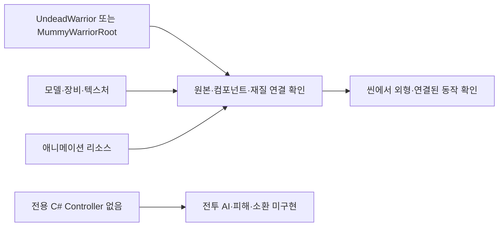

# Undead 리소스

언데드 전사와 관련 프리팹·모델 리소스를 보관한다. `Controller` 폴더가 있지만 현재 전용 C# 파일은 없다.

## 폴더 구성

| 폴더 | 설명 |
| --- | --- |
| `Controller` | 전용 Controller 코드가 없는 폴더 |
| `Models/Prefabs` | `UndeadWarrior.prefab`, `MummyWarriorRoot.prefab` |
| `Models/Animations` | 애니메이션 리소스 폴더 |
| `Models/Meshes`, `Models/Materials` | 모델과 재질 |
| `Models/Textures` | 몸체·머리·투구·방패·무기 등의 텍스처 |

## 사용 흐름과 확인

원하는 프리팹 선택 → 모델·장비·재질 연결 확인 → 씬에서 외형과 연결된 동작 확인 순서로 사용한다. 이 폴더에 독립된 전투 AI가 구현되어 있다고 가정하지 않는다.

`Mummy Warrior` 폴더의 프리팹과 이름이 비슷하므로 Unity Inspector에서 선택한 프리팹의 원본과 컴포넌트를 확인한다. 전투용 Controller, 피해 판정과 소환 설정 연결은 별도로 확인해야 한다.

관련 문서: [Mummy Warrior](<../Mummy Warrior/README.md>), [적 목록](../README.md).
