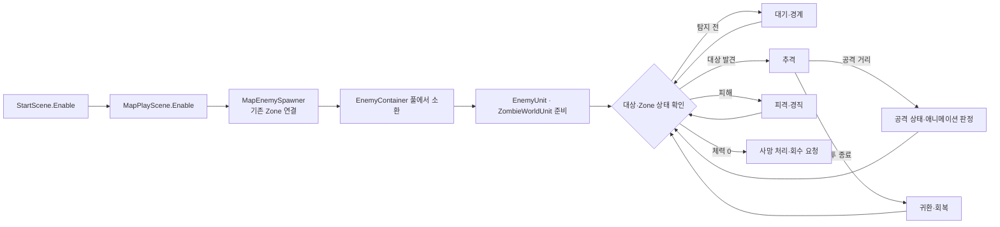

# 좀비

## 설정 전달

ZombieSettings는 원본 거리·각도로 기존 제곱 거리와 방향 내적 기준을 계산한 뒤 결과만 보관한다. 생성 후 읽지 않는 원본 복사 4개와 이동 방향 조회 2개를 제거했다. 접촉 후보 우선순위는 유지하며 PlayerHitRequest에 저장만 하던 접촉 종류 인자만 제거했다. 이번 간소화는 컴파일까지 확인했고 Play 확인은 남아 있다.

Boots가 등록한 GameData 목록 → 맵의 enemyId 선택 → EnemySpawnSettings.Config → Controller.SetData(config, target) → 기존 실행 설정 생성 순서다. 플레이어를 씬에서 검색하지 않는다. 추적 Transform과 Core의 피해·사망·효과 계약만 사용하며 다른 기능의 구체 클래스를 참조하지 않는다.

지상 구역에서 플레이어를 탐지하고 추격·공격하며, 전투가 끝나면 귀환하는 적이다. 실제 배치용 프리팹은 [Prefabs/Zombie.prefab](Prefabs/Zombie.prefab)이다.

## 폴더 구성

모든 하위 폴더의 코드는 `Zombie` 이름공간을 사용한다.

생명주기는 Core의 Init·Create·Enable·Tick·Disable·Release를 따른다. ZombieWorldUnit의 생성 작업은 OnUnitCreate, 구독 정리는 OnUnitRelease에 있다. 호출 순서는 [EnemyContainer](../Shared/README.md)가 담당한다.

| 폴더 | 설명 |
| --- | --- |
| `Lifecycle` | Unity 연결용 `ZombieController`와 실행용 `ZombieWorldUnit` |
| `StateMachine/States` | 생존·피격·사망 상태와 상태 전환 |
| `StateMachine/States/Alive` | 대기·경계·추격·공격·귀환 행동 |
| `Movement` | CharacterController 이동과 경로 안내 연결 |
| `Attack` | 공격 범위와 타격 판정 |
| `Animation` | Animator 제어와 공격·경계 동작 이벤트 |
| `Config`, `Configs` | 설정 타입, `ZombieConfig.asset`, `ZombieSpawnSettings.asset` |
| `Models` | 모델과 애니메이션 리소스 |
| `Models/Animations/Archive` | 이전 프리팹과 사용하지 않는 동작 보관 |

## 동작 흐름

StartScene이 플레이어·HUD를 준비하고 MapPlayScene.Enable이 MapEnemySpawner를 실행해 현재 맵의 기존 소환 구역을 연결한다. Zone1·Zone2·Zone3의 1·4·5개 지점에서 같은 ZombieSpawnSettings를 사용한다. 매 프레임 StartScene의 플레이어 다음 MapPlayScene이 EnemyContainer의 좀비를 갱신하며, 맵 이탈이나 플레이어 반환 전에 소환·갱신을 중지하고 풀까지 정리한다.

1. 소환 요청으로 풀에서 프리팹을 꺼내 위치·회전을 지정한다.
2. `EnemyUnit`이 체력을 초기화하고 `ZombieWorldUnit`이 경직·타격 정지·공격 판정과 상태머신을 준비한다.
3. 대상과 소속 Zone 정보를 읽어 대기·경계·추격·공격·귀환을 결정한다.
4. 경로 방향을 바탕으로 이동하고 애니메이션 이벤트에 맞춰 공격 판정을 연다.
5. 피해는 체력·경직과 피격 상태에 반영한다. 사망 상태 처리 후 회수를 요청한다.

`ZombieWorldUnit`의 Tick은 타격 정지 확인 → 상태 갱신 → 공격 판정 → 귀환 후 회복 순서다.

## 수치와 표시

- 탐지 등 전투 수치는 [ZombieConfig.asset](Configs/ZombieConfig.asset)에서 확인한다. 현재 탐지 거리 설정은 14m다.
- `IEnemyCombatStatus`로 체력과 전투 상태를 제공한다.
- 화면 HUD 체력바는 사용하지 않고, 머리 위 체력바의 표시는 `UI/CombatHud/EnemyHeadHealthBar.cs`에서 처리한다.

## Unity에서 확인

치트 피해·경직 수치와 `Test Damage` 메뉴는 [ZombieCheat.cs](Lifecycle/ZombieCheat.cs)에 분리했다. ZombieController의 Editor 전용 partial 선언이므로 기존 Inspector 필드·메뉴와 직렬화 필드 이름을 유지한다.
분리 후 Unity 컴파일은 통과했으며, Inspector 값·피해 메뉴의 실제 Play 실행은 이번 분리 작업에서 재검증하지 않았다.

- Controller의 Animator, Config, 공격별 HitShape 연결을 확인한다.
- `EnemyZoneController`의 `EnemySpawnSettings`와 `EnemyContainer.RegisterPool`은 맵 소환 담당을 통해 연결한다. 플레이어는 구역 Connect에 직접 전달한다.
- Zone의 BoxCollider, 플레이어, 소환 지점과 NavMesh를 확인한다.
- 현재 Zone 재소환은 시작 시와 플레이어가 구역 밖에서 안으로 들어올 때 빈 자리를 채우는 방식이다. 처치 후 제자리에서 기다리는 시간제 재소환은 아니다.
- 체력바는 전투 상태와 연동되므로 탐지·전투 해제 때 표시 변화를 확인한다.

실행 연결 후 Unity 컴파일과 기존 10개 배치 지점의 NavMesh 연결을 편집 상태에서 확인했다. 기존 좀비 AI·공격 설정·재진입 소환 조건은 유지했으며, 이번 변경 후 실제 Play 소환·전투·사망·풀 반환은 미검증이다.

관련 문서: [맵·Zone 연결](../../00.Scene/README.md), [적 공통](../Shared/README.md).
