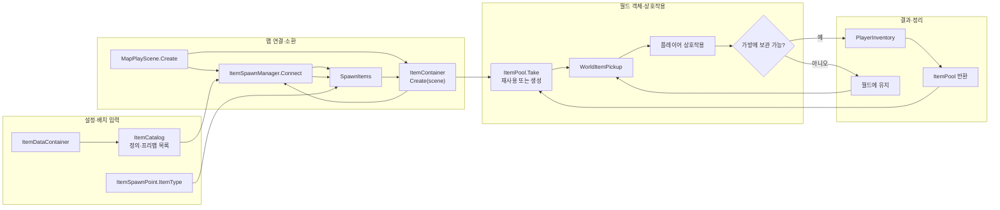

# 아이템

아이템 정의, 씬 배치와 플레이어의 획득 요청을 처리한다. 가방 슬롯과 보관 규칙은 `10.Player/Inventory`가 담당한다.

ItemContainer의 외부 호출이 없는 PoolCount 속성을 제거했다. 풀 보관·반환과 치트의 획득·소모 경로는 유지한다. 이번 간소화는 컴파일까지 확인했고 Play 확인은 남아 있다.

## 폴더 구성과 주요 파일

이 폴더의 코드는 `Item` 이름공간을 사용한다. 가방 요청은 Core.IInteractionActor를 사용하며 Player 구현을 참조하지 않는다.

[ItemContainer](ItemContainer.cs)는 소속 씬의 바닥 아이템 풀을 소유한다. MapPlayScene.Create가 `ItemSpawnManager.Connect(container, itemData)`를 호출해 맵의 기존 소환 지점을 준비한다. 맵 반환·종료에서 풀을 Dispose한다. 플레이어 인벤토리는 관리하지 않는다. [진입점과 이전 순서](../01.Boot/README.md)를 참고한다.

| 위치 | 설명 |
| --- | --- |
| `../04.Core/Item/ItemDefinition.cs` | 표시 이름, 아이콘과 최대 묶음 수를 가진 ScriptableObject |
| `../04.Core/Item/ItemType.cs`, `ItemCatalog.cs` | 아이템 종류와 정의·월드 프리팹의 연결 |
| `ItemSpawnPoint.cs` | 해당 위치에 생성할 아이템 종류 |
| `ItemSpawnManager.cs` | 시작 시 자식 소환 지점을 읽어 프리팹 생성 |
| `WorldItemPickup.cs` | 획득 가능 여부와 상호작용 처리 |
| `InventoryItem.cs` | 별도로 존재하는 획득용 컴포넌트. 가방 자료구조가 아님 |
| `Prefab` | Book·Scroll 프리팹, 아이템 정의와 ItemCatalog 에셋 |

## 생성과 획득 흐름

현재 `ItemSpawnManager`는 `Awake`에서 자동 실행되지 않는다. `Connect`를 호출하면 소환 지점의 `ItemType`과 Catalog로 항목을 찾고, `ItemContainer`가 관리하는 풀을 통해 아이템을 준비한다. 풀이 비어 있을 때만 `Instantiate`하며, 획득 성공 시 풀에 반환하고 가방이 가득 차면 바닥에 남긴다. 게임 시작에서 맵을 준비한 뒤 `Connect`를 호출하며 설정은 전역 데이터 목록에서 전달한다.

## 실행 확인

Start Play에서 아이템 풀 1개와 책 픽업 1개 생성을 확인했다. 실제 TryInteract API로 책을 얻으면 픽업이 비활성화되고, 교환 성공 시 책은 제거되고 스크롤은 보관되며 퀘스트·HUD가 ReachExit 단계로 바뀌었다. Ground 반환 후 월드 아이템 0과 ItemContainer 등록 해제를 확인했다. 이번에는 접근·상호작용 키 입력이나 가방이 가득 찬 경우를 재검증하지 않았다.

## Unity에서 확인

치트 창의 아이템 탭은 현재 게임 맵의 배치·획득 객체·교환 비용과 보상만 표시한다. `1개 지급`·`1개 소모`는 가방 API를, `맵에서 획득`·`사용처 실행`은 실제 맵 객체의 TryInteract를 호출한다. WorldItemPickupCheat·InventoryItemCheat·ItemExchangeCheat는 연결된 정의를 Editor에만 제공하며 런타임 획득·교환 로직은 유지한다. 새 일반 사용 효과는 추가하지 않았다. 이번 추가는 컴파일·창 구성 확인까지 마쳤으며 실제 Play 버튼 실행은 남아 있다. [치트 사용법과 확인 순서](../90.Editor/README.md)를 참고한다.

- GameData.Items와 자식 SpawnPoint의 ItemType을 확인한다.
- Catalog의 ItemDefinition과 WorldItemPrefab 연결을 확인한다.
- 획득 대상 Collider·레이어와 플레이어 상호작용 탐지 설정을 확인한다.
- 가방에 여유가 있을 때와 가득 찼을 때 안내·획득 결과를 확인한다.
- `InventoryItem`의 직렬화 필드 `count`는 현재 TryInteract의 보관 요청에 사용되지 않는다. 수량 획득이 구현되어 있다고 가정하지 않는다.

관련 문서: [플레이어](../10.Player/README.md), [교환·상호작용](../06.Data/README.md).
