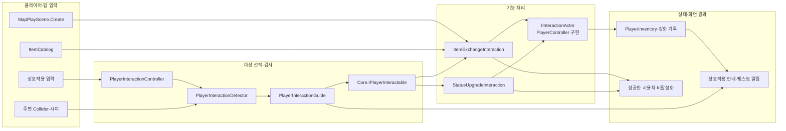

# 플레이어 상호작용

## 입력 → 대상 선택 → 실행 → 결과

플레이어 입력은 [PlayerInteractionController](../10.Player/Interaction/PlayerInteractionController.cs)에 도착한다. Controller는 감지기가 찾은 대상의 안내·가시성·실행 가능 여부를 확인한 뒤 Core의 `IPlayerInteractable.TryInteract`를 호출하고, 결과에 맞춰 대상을 다시 찾는다.

`PlayerInteractionDetector`는 상호작용 레이어의 근처 Collider를 재사용 배열로 찾고, 가림 레이어를 확인해 앞에 있는 실행 가능한 대상을 고른다. 감지 결과가 바뀌면 안내 변경 이벤트를 보낸다. 비활성화·반환 때 현재 대상을 비운다.

## 상호작용 종류

| 기능 | 입력·준비 | 조건과 처리 | 결과 |
| --- | --- | --- | --- |
| 아이템 교환 | MapPlayScene이 ItemCatalog에서 비용·보상 정의를 찾아 `Connect` | 비용 아이템 보유, 보상 슬롯에 저장 가능 여부를 기존 플레이어 API로 확인 | 비용을 보상으로 교환하고 성공한 물체 비활성화; 퀘스트는 실제 교환 알림을 읽음 |
| 석상 강화 | 씬에 배치된 `upgradeType` | 아직 같은 강화를 얻지 않았는지 확인 후 플레이어 API 호출 | 능력치 적용 성공 때 사용처 비활성화 |

잘못되었거나 연결되지 않은 교환 정의는 안내를 숨기고 실행을 막는다. 교환 비용 부족·보상 슬롯 부족은 화면에 가능한 이유를 안내한다. 석상은 이미 보유한 강화면 상호작용 대상 안내를 숨긴다.

상호작용 계약과 안내 값은 [Core 상호작용 코드](../04.Core/Interaction)에서 공유한다. 대상 감지·입력 연결은 Player에, 게임별 효과와 완료 처리는 이 폴더의 사용처에 둔다. Editor 치트는 실제 `TryInteract`를 호출할 수 있지만 거리 감지는 건너뛴다. [치트 안내](../90.Editor/README.md#아이템-탭)를 참고한다.

최근 상호작용 컴포넌트와 맵 설정을 재정리한 변경은 Unity 컴파일까지 확인했다. 이번 구조 갱신 후 물리적 접근·시야·입력부터 실제 아이템 교환·강화 완료까지의 전체 Play 흐름은 새로 검증하지 않았다.
