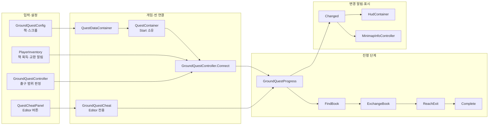

# 지상 퀘스트 진행

## 입력 → 판정 → 진행 기록 → 표시

`GroundQuestConfig`는 책과 스크롤 원본을 제공한다. `QuestDataContainer`가 설정을 보관하고, `QuestContainer`는 게임 동안 `GroundQuestProgress`를 유지한다. 씬의 `GroundQuestController`는 플레이어 가방·교환·출구 판정을 진행 기록에 전달하며, 맵을 바꿀 때 판정 연결만 끊는다.

`GroundQuestProgress`의 기본 단계는 `FindBook`이다. 가방에 책이 들어오면 `RecordBookFound`가 `ExchangeBook`으로 바꾼다. 책을 스크롤로 교환하면 `RecordBookExchanged`가 `ReachExit`으로 진행한다. 유효한 출구 영역 안에 살아 있는 플레이어가 도착하면 `RecordExitReached`가 `Complete`로 바꾼다. 각 단계 변경은 `Changed`를 한 번 알린다.

## 파일별 책임과 소유자

| 파일·객체 | 역할 | 보관 기간 |
| --- | --- | --- |
| [GroundQuestConfig.cs](GroundQuestConfig.cs) | 책·스크롤 에셋 참조 | 데이터 에셋 수명 |
| [QuestDataContainer.cs](../06.Data/QuestDataContainer.cs) | 설정 원본을 게임 흐름에 제공 | Boot 실행 동안 |
| [GroundQuestProgress.cs](GroundQuestProgress.cs) | 현재 단계와 변경 알림 관리 | QuestContainer 수명 |
| [QuestContainer.cs](../00.Scene/QuestContainer.cs) | 플레이어·설정을 전달하고 진행 기록 소유, 씬 판정 연결 목록 관리 | Start에서 맵 이동 동안 유지 |
| [GroundQuestController.cs](../00.Scene/GroundQuestController.cs) | 가방·교환 이벤트 구독, 출구 도착 판정 | 각 맵 씬에 연결된 동안 |
| [GroundQuestCheat.cs](GroundQuestCheat.cs) | Editor에서 진행 단계를 처음으로 되돌림 | `UNITY_EDITOR` 빌드에서만 포함 |

`MapPlayScene.Create`가 같은 씬의 GroundQuestController를 `QuestContainer.Connect`로 연결한다. `MapPlayScene.Tick`이 퀘스트 출구 판정을 갱신한다. 씬 이탈은 controller 구독을 끊지만 `QuestContainer.Ground`는 남는다. 게임 전체 반환에서 QuestContainer를 Dispose한 뒤 새로 만들면 진행은 첫 단계에서 시작한다.

Ground 씬의 `exitArea`는 아직 미지정이다. 따라서 책 획득·교환 진행은 연결되어도 실제 출구 도착 완료는 실행되지 않는다. 새 맵에 출구를 배치할 때 해당 BoxCollider를 연결해야 한다.

## Editor에서 확인

`Tools > Cheat > 치트 창 > 퀘스트`에서 책 발견·교환 완료·출구 도착·전체 완료 기록을 호출하고 현재 단계를 본다. `진행 초기화`는 Editor 전용 `CheatReset`으로 첫 단계에 돌리고 기존 `Changed` 알림을 보낸다. 이 버튼은 인벤토리·아이템 교환 객체·플레이어 위치를 바꾸지 않는다. 이후 실제 아이템 행동이나 출구 판정이 일어나면 게임의 현재 상태에 따라 진행이 다시 바뀔 수 있다. 치트와 Data 창의 자세한 동작은 [Editor 안내](../90.Editor/README.md#퀘스트-탭)를 참고한다.

최근 Unity 컴파일과 퀘스트 탭의 준비 전 버튼 비활성화는 확인했다. 기록 변경·초기화에 따른 HUD 갱신과 실제 아이템·출구 상호작용의 Play 확인, 빌드는 남아 있다.
