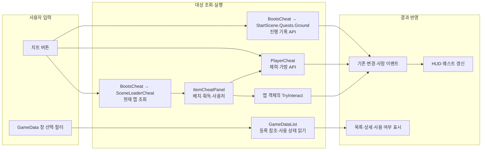

# 개발용 치트·데이터 창

`Tools > Cheat > 치트 창`에서 Addressable·플레이어·아이템·퀘스트 탭을 선택한다. UI는 Editor 어셈블리에 있고, 엔티티의 치트 진입점은 `UNITY_EDITOR`로 감싼 별도 `*Cheat.cs`에 있다.

## Data 창

`Tools > Data > 게임 데이터`에서 Play 전에도 등록 목록을 볼 수 있다. 열린 씬의 Boots.gameData를 우선 선택하며, Boot가 없으면 프로젝트의 GameData 에셋을 찾는다. 창 위의 `등록 목록`에서 다른 GameData를 선택할 수 있으며 씬의 참조는 바꾸지 않는다.

- GameData의 플레이어·적·아이템·퀘스트 설정과 직렬화된 ScriptableObject 연결을 따라 공격 데이터·아이템 정의까지 표시한다. 텍스처·음원·프리팹 내부까지 검색하는 리소스 창은 아니다.
- 왼쪽에서 PlayerDataContainer·EnemyDataContainer·ItemDataContainer·QuestDataContainer를 선택하면 그 컨테이너의 데이터만 표시한다. `원본`과 원본이 참조하는 `연결 데이터`를 구분하며, 이름·타입·경로 검색과 `사용 중만` 필터를 제공한다.
- 행을 선택하면 연결 경로와 읽기 전용 Inspector를 보여 준다. `Project · Inspector에서 열기`는 원본 에셋을 선택한다.
- 실행 전에는 선택한 GameData의 등록 예정 데이터를 `미실행`으로 표시한다. 실행 중에는 BootsCheat.CopyCheatData가 선택한 컨테이너만 조회해 직접 보관한 항목은 `보관 중`, 그 원본의 연결 항목은 `연결 사용`, 나머지는 `미사용`으로 표시한다. 선택한 GameData에 없는 실제 보관 데이터도 목록에 추가한다. 다른 컨테이너의 공유 참조는 선택한 컨테이너의 사용 상태로 계산하지 않는다.
- `사용 중`은 데이터 컨테이너가 보관한다는 의미다. 현재 맵에 해당 적이 살아 있는지, 개별 설정이 최근 호출되었는지, 메모리를 몇 바이트 쓰는지를 뜻하지 않는다. 일부 게임 객체만 반환해도 데이터 컨테이너가 유지되면 계속 사용 중으로 표시한다.
- 프로젝트 변경·새로고침 때 목록을 다시 읽고, 실행 상태는 0.5초마다 갱신한다. 창은 데이터 컨테이너를 생성·해제하거나 설정 값을 수정하지 않는다.

표시와 필터는 [GameDataWindow](GameDataWindow.cs), 에셋 연결 탐색과 실제 보관 참조 대조는 [GameDataList](GameDataList.cs)가 맡는다. 데이터 설정 자체의 책임과 경로는 [데이터 안내](../06.Data/README.md)를 따른다.

## 입력 → 처리 → 결과

게임 기능의 판단과 상태 변경은 기존 API에 맡긴다. 창은 입력값·대상을 선택하고 실행 전후 값과 결과를 표시한다. 치트 창을 열거나 탭을 바꾸는 것만으로 체력·아이템을 변경하지 않는다.

## 퀘스트 탭

[QuestCheatPanel](QuestCheatPanel.cs)은 현재 게임이 유지하는 지상 탐험 기록을 표시한다. 버튼 입력 → 기존 RecordBookFound·RecordBookExchanged·RecordExitReached → Changed → HUD 순서다. 새 퀘스트나 가방 데이터를 만들지 않는다.

| 버튼 | 처리 |
| --- | --- |
| 책 발견 기록 | 책 찾기 단계에서 교환 단계로 진행 |
| 교환 완료 기록 | 기존 기록 함수의 허용 범위에서 출구 이동 단계로 진행 |
| 출구 도착 기록 | 출구 이동 단계에서 완료 |
| 전체 완료 | 기존 세 기록 함수를 순서대로 호출 |
| 진행 초기화 | Editor 전용 GroundQuestCheat에서 첫 단계로 되돌리고 기존 변경 알림 전송 |

준비 전·맵 이동·반환 중에는 실행을 막고, 완료 여부에 따라 가능한 버튼만 켠다. 진행 기록만 바꾸므로 가방·교환 사용처·맵 위치는 유지한다. 초기화 후 실제 인벤토리 변경·교환·출구 판정이 발생하면 그 사실에 맞춰 다시 진행될 수 있다. 실제 아이템 효과와 진행 기록을 함께 확인하려면 아이템 탭에서 획득·사용처 실행을 사용한다. 플레이어 사망 여부와 퀘스트 기록은 별개이므로 게임과 기록이 준비되어 있으면 사망 상태에서도 기록을 조작할 수 있다.

## 플레이어 탭

기존 이동 기능 위에 [PlayerHealthPanel](PlayerHealthPanel.cs)을 표시한다. 살아 있고 활성화된 플레이어에게 실행하며, 감소량은 양수의 유한한 값만 허용한다.

| 버튼 | 처리 | 확인할 결과 |
| --- | --- | --- |
| 체력 감소 | 입력한 감소량을 기존 Health.TakeDamage에 전달 | 구르기·방어 판정을 거치지 않는 체력 변경, HUD, 체력 0일 때 사망 |
| 피격 처리 | 기존 TryTakeHit에 경량·방어 불가 피해 전달 | 구르기 무적 등 피격 판정과 체력·피격 반응 |
| 즉사 | 남은 체력만큼 감소 | 기존 사망 이벤트와 사망 상태 전환 |

`체력 감소`는 버튼을 누를 때마다 한 번 적용한다. 자동으로 지속 피해를 주거나 부활시키는 기능은 없다. 치트 API는 [PlayerCheat](../10.Player/Lifecycle/PlayerCheat.cs)에 있다.

## 아이템 탭

[ItemCheatPanel](ItemCheatPanel.cs)은 `BootsCheat.TryGetCheatMap`으로 준비된 게임 맵을 조회한다. 해당 맵의 ItemSpawnPoint, WorldItemPickup, InventoryItem, ItemExchangeInteraction 비용·보상에 연결된 정의만 목록에 표시한다. 전체 카탈로그나 Editor의 활성 씬을 맵으로 대신하지 않는다.

| 버튼 | 처리 | 맵 객체에 미치는 영향 |
| --- | --- | --- |
| 1개 지급 | TryStoreInventoryItem으로 가방에 추가 | 배치된 아이템 유지 |
| 맵에서 획득 | 실행 가능한 획득 객체의 TryInteract 호출 | 기존 풀 반환·비활성화 처리 |
| 1개 소모 | Inventory.TryRemove로 수량 한 개 제거 | 사용 효과·교환 없이 가방 변경 알림만 발생 |
| 사용처 실행 | 선택한 ItemExchangeInteraction.TryInteract 호출 | 기존 비용·보상·교환 알림·사용처 비활성화 처리 |

사용처가 여러 개면 오브젝트 경로가 표시된 드롭다운으로 고른다. 맵 획득은 가능한 첫 번째 대상이며 버튼 툴팁에 경로가 나온다. 두 맵 상호작용 버튼은 접근 거리 없이 호출하지만 기존 수량·슬롯·활성 상태 조건은 따른다. 일반 소비 아이템의 새 사용 효과를 추가한 것은 아니다.

맵 로딩·전환·반환 중에는 목록을 비우고 실행을 막는다. 플레이어가 없거나 사망했거나 가방·사용처 조건을 만족하지 않으면 해당 버튼을 끈다. 이미 획득했거나 사용한 객체도 정의가 남아 있으면 목록에는 표시하며 실제 맵 실행 버튼은 비활성화한다. 같은 맵에서는 0.5초마다 수량·실행 가능 여부를 읽고, 배치를 새로 추가했다면 `아이템·사용처 새로고침`을 누른다.

## 직접 확인할 순서

1. Start 씬에서 Play하고 맵과 플레이어 준비를 기다린다.
2. 플레이어 탭에서 감소량을 바꾸며 `체력 감소`와 `피격 처리`의 체력·HUD·반응 차이를 확인한다.
3. 아이템 탭에서 지급 → 소모를 실행해 가방 표시를 확인한다. 이어 맵에서 획득 → 사용처 실행으로 월드 객체·보상·퀘스트 변화를 확인한다.
4. 사용 완료 대상, 수량 부족, 가방 용량 부족에서 해당 버튼이 꺼지는지 확인한다.
5. 마지막에 즉사를 실행하고 사망 후 버튼이 꺼지는지 확인한다. 재시작과 맵 이동 후 이전 맵 대상이 남지 않는지도 확인한다.

## 확인 상태

Unity 최종 컴파일 정상과 네 치트 탭·퀘스트 대기 표시·Play 전 완료 버튼 비활성화를 확인했다. Data 창은 컨테이너 선택에 따라 플레이어 7개·적 8개·아이템 3개·퀘스트 3개가 각각 표시되고, 미실행에서는 보관 원본 0개로 표시되는 것을 확인했다. 최종 Console 현재 오류·경고는 0이다. CopyCheatData 시그니처와 호출부를 나누어 편집하던 중의 컴파일 오류는 최종 호출부 반영 후 해소했다. 앞선 Pipeline 도구 시간 초과·그림자 경고는 별도 과거 기록이다. 이번 퀘스트 버튼과 컨테이너 보관 상태 전환의 실제 Play 실행·빌드는 아직 수행하지 않았다.

Addressable 생성·반환 사용법은 [로딩 안내](../03.Loading/README.md#addressables-cheat-창에서-확인)를 따른다.
