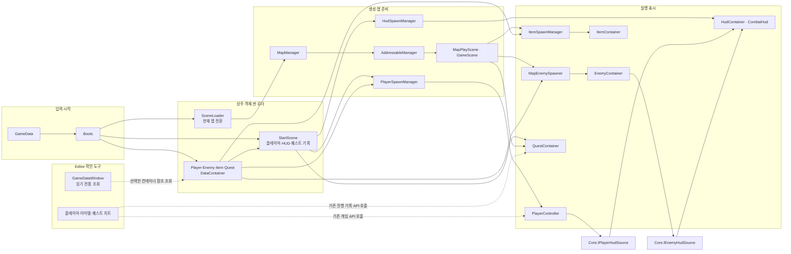
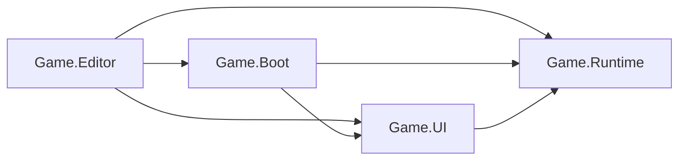

# 프로젝트 구조 안내

이 문서는 코드·씬·에셋을 찾고 주요 호출 흐름을 따라가는 시작점이다. 각 기능의 입력과 결과, 현재 연결 상태는 해당 폴더의 README에서 확인한다. 실제 동작은 README보다 코드·씬·프리팹 설정을 기준으로 판단한다.

## 실행 구조 한눈에 보기

모든 프로젝트 그림은 좌→우로 `입력 → 연결·생성 → 실행 → 표시·정리`를 따른다. 아래 구성요소 이름은 관련 README에서도 그대로 사용해 구조도를 이어 볼 수 있도록 맞췄다.

씬 이동에서는 `SceneLoader`가 현재 `GameScene`을 정리하고 `MapManager`에 다음 주소를 요청한다. 새 `MapPlayScene`은 맵 전용 객체를 만들고, `StartScene`은 기존 플레이어·HUD·퀘스트 진행을 유지해 새 맵에 연결한다. 현재 맵 이동 트리거는 연결되지 않았다.

## 폴더별 역할

| 폴더 | 입력·책임 | 안내 |
| --- | --- | --- |
| [00.Scene](00.Scene/README.md) | Start·Ground·UnderGround 씬, 맵 구성과 실행 연결 | 씬 소유 객체와 배치·리소스 소속 |
| [01.Boot](01.Boot/README.md) | Inspector의 GameData를 등록하고 첫 씬 로드·종료를 시작 | 실제 시작·반환 순서 |
| [02.Manager](02.Manager/README.md) | 플레이어·HUD 생성 담당과 카메라 리스너·맵 요청 관리자 | 객체 생성·리소스 소유 |
| [03.Loading](03.Loading/README.md) | SceneLoader의 맵 전환과 Addressables 생명주기 | 씬 로드·해제 흐름 |
| [04.Core](04.Core/README.md) | 객체 생명주기, 싱글톤, 상수와 공유 계약 | 기능 사이의 공통 규칙 |
| [04.Core/Character](04.Core/Character/README.md) | 체력·피해·캐릭터 생명주기·HUD 계약 | 플레이어·적 공통 코드 |
| [05.Settings](05.Settings) | 렌더링·품질 설정 에셋 | 프로젝트 설정 위치 |
| [06.Data](06.Data/README.md) | GameData와 Player·Enemy·Item·Quest 설정 컨테이너 | 입력 데이터와 소비처 |
| [10.Player](10.Player/README.md) | 입력·이동·전투·시점·인벤토리·플레이어 상태 | 플레이어 내부 흐름 |
| [11.Enemy](11.Enemy/README.md) | 적 공통 컨테이너와 적 종류별 구현·리소스 | 소환·전투 흐름 |
| [12.Item](12.Item/README.md) | 아이템 정의·맵 배치·획득 요청 | 생성·가방 전달 |
| [14.Interaction](14.Interaction/README.md) | 상호작용 대상 감지 계약의 사용처와 실행 결과 | 석상 강화·아이템 교환 |
| [15.Effects](15.Effects) | 전투 효과 구현·리소스 | 타격 효과 연결 |
| [16.Quest](16.Quest/README.md) | 지상 퀘스트 진행 설정·상태·Editor 전용 진행 초기화 | [퀘스트 치트](90.Editor/README.md#퀘스트-탭) |
| [18.GUI](18.GUI) | HUD 화면·표시용 이미지와 프리팹 | UI 리소스 |
| [19.Zone](19.Zone) | 미니맵 영역·층 정보 | 맵 표시 자료 |
| [20.Physics](20.Physics) | 계단 보행용 충돌 데이터 | 물리 리소스 |
| [UI](UI/README.md) | 전투 HUD·미니맵의 연결·표시·정리 | 표시 계약과 반환 흐름 |
| [Runtime](Runtime) | 플레이어 배치용 PlayerRoot 프리팹 | Addressables 입력 |
| [90.Editor](90.Editor/README.md) | 플레이어·아이템·퀘스트 치트, 컨테이너별 데이터 조회와 편집 도구 | 실행·확인 방법 |

## 데이터·소유·반환

`GameData`는 설정 참조 목록이다. `Boots`가 네 데이터 컨테이너를 만들고, 생성 담당이나 `MapPlayScene`이 필요한 설정만 각 실행 객체에 전달한다. 데이터 컨테이너는 원본 설정을 보관하고, 플레이 중 체력·가방·적 풀·퀘스트 진행은 각 실행 객체가 소유한다.

| 단계 | 입력 | 처리 | 결과·소유자 |
| --- | --- | --- | --- |
| 게임 시작 | Start 씬의 Boots·GameData | 데이터 컨테이너 생성, StartScene 초기화 | 상주 플레이어·HUD·퀘스트 준비 |
| 맵 준비 | SceneLoader의 맵 주소 | MapManager·AddressableManager 로드 후 MapPlayScene 실행 | 맵 아이템·적·퀘스트 연결 |
| 플레이 | 입력·시간·월드 상태 | PlayerController·EnemyContainer·퀘스트 갱신 | HUD 계약을 통해 표시 |
| 맵 이탈 | 다음 맵 주소 또는 종료 | 현재 GameScene·맵 컨테이너·구독·요청 정리 | StartScene의 상주 객체는 유지 또는 전체 종료 때 반환 |

Addressables 관리자는 로드 핸들과 요청 횟수를 소유한다. 각 호출자는 자신이 요청한 횟수만 반환한다. 프리팹 인스턴스는 생성한 관리자, 맵에 배치한 GameObject는 씬이 소유한다.

## 폴더와 어셈블리

번호는 Project 창에서 찾기 위한 정렬이다. 실제 호출 순서는 코드가 정한다. 기능 폴더의 하위 폴더는 파일을 찾기 위한 분류이고, 이름공간은 기능 이름 하나를 사용한다.

`00.Scene/Play`와 `02.Manager`의 생성 담당 코드는 `Game.Boot`, `00.Scene`의 맵 코드·`03.Loading`·`02.Manager/Resources`는 `Game.Runtime`이다. `UI`는 `Game.UI`이며 공유 Core와 적·플레이어 기능은 `Game.Runtime`에 포함된다. 폴더의 `.asmref`는 이 기존 어셈블리에 연결한다.

공유 이름도 README 간 동일하게 유지한다. 예를 들어 `MapPlayScene`, `MapEnemySpawner`, `EnemyContainer`, `IPlayerHudSource`, `IEnemyHudSource`, `HudContainer`는 관련 그림에서 같은 연결 이름으로 표시한다. 세부 흐름은 [진입점](01.Boot/README.md), [씬](00.Scene/README.md), [데이터](06.Data/README.md), [플레이어](10.Player/README.md), [적](11.Enemy/README.md), [아이템](12.Item/README.md), [HUD](UI/README.md) 순으로 따라가면 된다.

## 갱신 기준

README를 바꿀 때는 호출자 → 처리 대상 → 반환 소유자를 코드·씬 설정에서 확인한다. 그림은 가로 방향의 입력·처리·결과 단계를 유지하고, 같은 클래스·계약 이름을 관련 README에서 반복 사용한다. 속성 선언·참조·인터페이스 계약을 검토한 최근 정리 범위는 [속성 정리 기록](../../Docs/Work/property-cleanup.md)에 있다.
