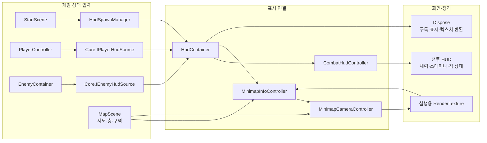

# HUD와 미니맵

## 현재 연결

입력: StartScene이 HudSpawnManager에 플레이어·퀘스트 전달 → CombatHud 생성 → HudContainer.Add(CombatHudController)·Add(MinimapInfoController) → 전투 상태 구독과 미니맵 플레이어 연결 → 부모 활성화 후 화면 준비 상태 확인.

플레이어 연결은 [IPlayerHudSource](../04.Core/Character/IPlayerHudSource.cs)를 사용한다. HudSpawnManager·HudContainer·CombatHudController는 PlayerController·PlayerUnit·PlayerStamina·PlayerInventory를 참조하지 않는다. 플레이어가 표시 수치·슬롯별 아이템·상호작용 안내와 변경 알림을 제공하고, ToolkitView는 수치와 두 슬롯의 아이템만 받아 그린다. 미니맵은 같은 계약의 FollowTarget으로 기존 위치 추적을 유지한다.

적 목록 연결은 [IEnemyHudSource](../04.Core/Character/IEnemyHudSource.cs)를 사용한다. HudContainer·CombatHudController는 EnemyContainer 구현 대신 현재 활성 목록과 활성·비활성 이벤트만 받는다. 기존 [IEnemyCombatStatus](../04.Core/Character/IEnemyCombatStatus.cs)도 Core에 두어 체력·경직·전투 상태를 읽는다. EnemyContainer는 기존 목록과 이벤트를 그대로 제공하며 소환·풀 반환·정리 권한은 표시 계약에 포함하지 않는다. 머리 위 체력바의 기존 EnemyView 연결은 유지한다.

| 담당 | 역할 |
| --- | --- |
| CombatHudController·CombatHudToolkitView | 플레이어 체력·스태미나·인벤토리·상호작용, 연결된 적의 전투 상태 표시 |
| HudContainer | 전투 HUD·미니맵에 같은 플레이어 전달, 적 연결과 구독·표시 대상 반환 |
| MinimapInfoController | UI Toolkit에 지도 영상·현재 구역·석상 이름 표시, 씬 변경 때 MapArea 캐시 갱신 |
| MinimapCameraController | 플레이어 위치·방향 추적, MinimapFloor에 따른 층 높이 선택, 실행용 RenderTexture 생성·반환 |

[CombatHud 프리팹](../18.GUI/CombatHud/CombatHud.prefab)에 UIDocument·전투 HUD·MinimapInfoController와 자식 MinimapCamera·MinimapPlayerMarker를 연결했다. StartScene은 HudSpawnManager를 통해 UI에 플레이어를 전달하며 카메라·지도 도형을 직접 관리하지 않는다. 맵 씬은 지도 도형·MinimapFloor·MapArea를 소유한다.

미니맵 카메라는 기존 설정과 같은 23번 지도 레이어만 512×512 RenderTexture에 그린다. 공유 텍스처 에셋은 설정 원본으로 유지하고 각 HUD가 실행용 텍스처를 만들어 화면에 연결한다. MainCamera는 이 레이어를 제외한다. 플레이어 화살표는 HUD와 함께 생성되며 미니맵 카메라에는 AudioListener를 추가하지 않는다.

층 선택은 기존 MinimapFloor의 높이 범위, 현재 위치 표시는 기존 MapArea 판정을 사용한다. 씬 로딩·해제 때만 표시 자료를 다시 읽고 이동 중에는 캐시를 사용한다. StartScene이 QuestContainer.Ground를 미니맵에 전달한다. 미니맵은 GroundQuestProgress의 변경 알림을 구독하며 맵의 퀘스트 연결 컴포넌트를 직접 참조하지 않는다. 진행 객체가 없으면 퀘스트 영역은 숨긴다. Ground의 출구 영역은 아직 미지정이다.

## 반환

맵 이동에는 HUD·미니맵 객체와 실행용 RenderTexture를 유지한다. MapPlayScene이 이전 적 목록을 RemoveEnemies로 해제하고 새 맵 적 목록을 AddEnemies로 연결한다. 지도 자료는 기존 씬 로드·해제 알림으로 다시 읽는다. 이 전환 구조 변경 후 실제 지상·지하 왕복 표시는 아직 실행 확인하지 않았다.

HUD는 연결 시 안내·활성 알림을 구독하고, 플레이어가 활성 상태이면 체력·사망·스태미나·아이템 알림을 구독한다. 비활성화 때 수치 구독을 해제하며, HUD 비활성화·Disconnect 때 안내·활성 알림도 해제한다. PlayerController의 계약 구현은 첫 구독 때만 기존 이벤트에 연결하고 마지막 구독 해제 때 끊는다. 플레이어 최종 반환에서도 남은 중계 구독을 정리한다. 표시 값의 별도 복사본이나 매 프레임 조회는 두지 않는다.

HUD 반환 → HudSpawnManager.Release → HudContainer.Dispose → 전투 HUD 구독 해제·미니맵 화면의 텍스처 참조 제거 → 씬·퀘스트 구독 해제·카메라 추적 중지 → 실행용 RenderTexture.Release·Destroy → HUD 객체 파괴 완료 → CombatHud 원본 요청 반환.

HUD 삭제·플레이어 삭제·전체 게임 반환·부분 시작 실패에서 같은 경로를 사용한다. 컴포넌트 OnDestroy도 정리를 수행하며 반복 Disconnect는 안전하게 처리한다. 비활성화만 할 때는 추적과 구독을 멈추고, 재활성화할 수 있도록 플레이어와 실행용 텍스처는 유지한다.

## 확인과 남은 작업

플레이어·적 HUD 계약 분리 후 Unity 컴파일과 아래 Play 확인을 완료했다. 퀘스트·지도 구역의 기존 연결은 유지한다. 검증은 기존 치트·공개 API와 런타임 표시 조회를 사용했고 테스트 파일·에셋 변경은 추가하지 않았다.

- Start 준비 후 피해 치트로 체력 100 → 90과 HUD `90 / 100`, 스태미나 소비 API로 100 → 90과 채움 배율 0.9를 확인했다. 실제 공격·구르기 입력에 따른 모든 표시 조합을 확인한 것은 아니다.
- 실제 소환된 아이템의 TryInteract로 책을 획득하고 교환 물체의 TryInteract로 스크롤을 받아 슬롯 아이콘 일치를 확인했다. 기존 감지 API에서 `책 줍기` 안내 표시와 대상 해제 후 숨김도 확인했다.
- 플레이어·HUD를 각각 두 번 비활성화·재활성화한 뒤 체력·스태미나·아이템·안내·활성 알림은 각 1개, 적 활성·비활성 구독도 각 1개를 유지했다.
- 기존 NightShade 풀 API로 소환해 표시 대상 1개, 피해 250 → 240과 HUD `240 / 250`, 풀 반환 시 표시 대상 0개와 체력바 숨김, 재소환 시 대상 1개·체력 250 복구를 확인했다. Ground 좀비 10개의 화면 체력바 제외 규칙은 유지됐다.
- HUD 치트 반환 Task 완료 후 HUD 객체와 플레이어·적 HUD 구독은 모두 0개였다. 플레이어·적은 남았고 스태미나 소비도 계속 가능했다. 플레이어 반환 Task 완료 후 플레이어·적·HUD 객체 0개, 전체 반환 완료 후 Start 씬만 남았다.
- 최종 Console 오류·경고 0을 확인했다. 앞선 도구 조회 시간 초과·최상위 await 평가 실패, 실행 중 Play 종료로 중단된 조회는 통과 기록에 포함하지 않았다. 확인을 위해 멈춘 시간은 복구하고 Play를 종료했으며 저장되지 않은 Start 씬 변경은 보존했다. 빌드·모든 입력 조합·보스 전투 전체는 미검증이다.

아래는 HUD 계약 분리 이전 단계의 화면·반환 확인 기록이다. 최신 계약 분리 결과는 위 항목을 기준으로 한다.

- 프리팹의 미니맵 카메라·표시 컴포넌트·공유 텍스처와 MainCamera의 지도 레이어 제외를 확인했다. Start Play에서 전투 HUD·MinimapInfoController 준비 완료, 오른쪽 위 지도·플레이어 표시·현재 위치 표시를 확인했다. 활성 카메라 2개·AudioListener 1개다.
- 기존 피격 치트로 체력 90 → 80과 HUD 80/100을 확인했다. 책 획득·교환 TryInteract API 호출 후 퀘스트 단계와 완료 문구가 즉시 갱신됐다.
- 치트와 같은 Boots.DeleteResource("CombatHud", false) 호출이 완료된 뒤 UIDocument 0, MinimapView_Runtime 텍스처 0, 활성 카메라 1개, HUD 원본 요청 제거를 확인했다. 이때 플레이어와 적 10개·Ground는 유지됐다. 이어 플레이어·Ground 반환과 Play 재시작도 확인했다.
- 마지막 재시작의 compilationFailed=false·Console 오류 및 경고 0을 확인했다. 앞선 실행 중 조회 도구 시간 초과 기록과 구분하며 로그를 수동으로 지우지 않았다.
- 지하 맵의 층 전환·위치 표시, 이번 변경 후 스태미나의 모든 행동별 표시, HUD를 남긴 채 PlayerRoot·Ground를 직접 삭제하는 각각의 경로, 번들/Player 빌드는 이번에 확인하지 않았다. Ground 출구 영역은 미지정이다.
