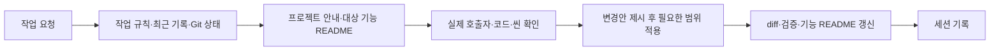

# 프로젝트 공통 규칙

이 폴더는 Refact_3DGame에서 함께 사용하는 작업 규칙의 원문을 보관한다. 규칙은 저장소에 포함하며, 특정 에이전트의 개인 설정이나 플러그인 설치를 전제로 하지 않는다.

## 읽는 순서

1. 모든 작업 전에 [작업 규칙](work-rules.md)과 [마지막 세션 기록](../Work/last-session.md)의 최근 작업을 읽고 Git 변경 상태를 확인한다.
2. 코드 작업 전에는 [코드 작성](coding-style.md), [구조와 소유](architecture.md), [폴더](folder-rules.md) 규칙을 읽는다.
3. 커밋 작업 전에는 [커밋 규칙](commit-rules.md)을 읽는다.
4. [프로젝트 폴더 안내](../../Assets/_Project/README.md)와 대상 기능의 README를 확인한 뒤 필요한 실제 코드를 읽는다. 현재 동작 판단은 코드·씬 설정을 기준으로 한다.
5. 생성·갱신·반환을 바꿀 때는 [진입점 안내](../../Assets/_Project/01.Boot/README.md) → 해당 호출자 → 대상 기능 → 정리 경로 순서로 확인한다. 관련 없는 기능 전체를 읽거나 함께 수정하지 않는다.

## 문서별 역할

| 문서 | 내용 |
| --- | --- |
| [work-rules.md](work-rules.md) | 요청 해석, 수정 전 설명, 검증, 세션 기록 |
| [commit-rules.md](commit-rules.md) | 커밋 범위, 메시지, Unity 파일 포함 기준 |
| [coding-style.md](coding-style.md) | 책임 분리, 이름, 주석, GC, 생명주기 |
| [folder-rules.md](folder-rules.md) | 번호, 코드·에셋·문서 위치, 어셈블리 |
| [architecture.md](architecture.md) | 객체 소유, 전역 접근, 현재 컨테이너 책임 |

사용자의 현재 명시적 요청이 기존 프로젝트 규칙과 다르면 요청을 우선하고, 필요한 규칙만 함께 갱신한다. 세션 기록은 진행 상황이며 영구 규칙을 대신하지 않는다. 현재 코드와 기록이 다르면 차이를 확인하고 기록을 고친다.

규칙 변경은 해당 원문에서 한다. 루트 AGENTS.md와 기능 README에는 같은 규칙 전문을 복사하지 않고 링크를 둔다. 현재 호출 순서·설정·진행 상태는 각 기능 폴더의 README에 기록하고, 기능을 변경한 단계에서 즉시 함께 갱신한다. 구체적인 기준은 [기능 폴더의 현재 상태 갱신](work-rules.md#기능-폴더의-현재-상태-갱신)을 따른다.

## 규칙과 현재 구현 구분

- 규칙은 앞으로 지킬 책임·명명·작업 기준이다. 기능 README는 현재 코드의 입력 → 처리 → 결과와 연결 상태를 설명한다. 세션 기록은 특정 작업의 결과이며 영구 설계 제한이 아니다.
- 현재 동작은 실제 코드와 씬·프리팹·패키지 설정으로 판단한다. 문서가 다르면 오래된 설명을 고치고, 문서에 맞추려고 동작 중인 코드를 되돌리지 않는다.
- 코드가 확정 규칙과 다르면 차이와 영향을 먼저 설명한다. 이번 요청 범위를 벗어나는 일괄 수정이나 규칙의 임의 완화는 하지 않는다.
- 버전·도구 상태는 ProjectSettings/ProjectVersion.txt, Packages/manifest.json과 실제 연결 응답으로 확인한다. 세션에서 한 번 연결됐다는 기록을 현재 연결 증거로 사용하지 않는다.

## Project_P에서 참고한 부분

Project_P의 AGENTS.md·CLAUDE.md에서 진입 문서와 공통 규칙 분리, Docs/coding-style.md에서 한국어 주석과 명확한 이름, Docs/architecture.md에서 의존성 전달과 과도한 분리 방지 방식을 참고했다.

Project_P의 Docs/commit-rules.md는 현재 로컬에 없어 이 프로젝트의 커밋 규칙을 별도로 작성했다. 기존 UI Toolkit, 이름공간, 일반 C# 컨테이너 구조를 기준으로 정리했으며 특정 UI 기술·패키지·전역 매니저 구조를 새로 강제하지 않는다.
